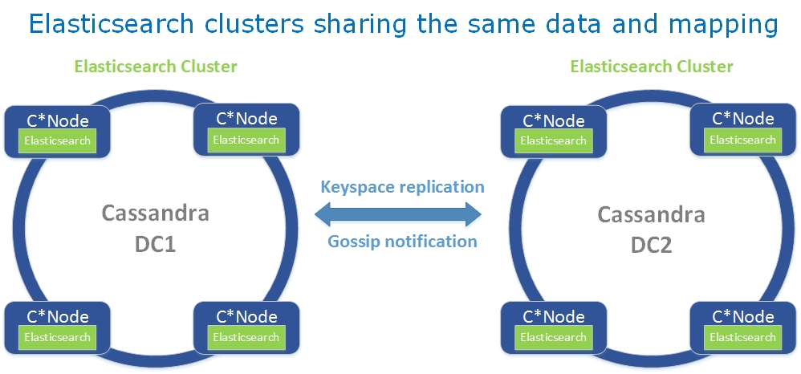

Configuration
=============

Directory Layout
----------------

Elassandra merge the cassandra and elasticsearch directories as follow :

* ``conf`` : Cassandra configuration directory + elasticsearch.yml default configurtion file.
* ``bin`` : Cassandra scripts + elasticsearch plugin script.
* ``lib`` : Cassandra and elasticsearch jar dependency    
* ``pylib`` : Cqlsh python library.  
* ``tools`` : Cassandra tools.
* ``plugins`` : Elasticsearch plugin installation directory.
* ``work`` : Elasticsearch working directory.

Elasticsearch paths are set accroding to the following environnement variables and system properties :

* ``path.home`` : **CASSANDRA_HOME** environnement variable, cassandra.home or path.home system property, the current directory.
* ``path.conf`` : **CASSANDRA_CONF** environnement variable, path.conf or path.home.
* ``path.data`` : **cassandra_storagedir**/data/elasticsearch.data, path.data system property or path.home/data/elasticsearch.data

Elasticsearch configuration
---------------------------

Elasticsearch configuration rely on cassandra configuration file 'conf/cassandra.yaml' for the following parameters. Node role (master, primary, data) is automatically set by elassandra.

.. cssclass:: table-bordered

+-------------------+--------------------------+---------------------------------------------------------------------+
| Cassandra         | Elasticsearch            | Description                                                         |
+===================+==========================+=====================================================================+
| ``cluster.name``  | ``cluster_name``         | Elasticsearch cluster name is mapped to the cassandra cluster name. |
+-------------------+--------------------------+---------------------------------------------------------------------+
| ``rpc_address``   | ``network.host``         | Elasticsearch listen on the cassandra rpc addresses                 |
|                   |                          |                                                                     |
| ``rpc_interface`` | ``http.bind_host``       |                                                                     |
|                   |                          |                                                                     |
|                   | ``http.netty.bind_host`` |                                                                     |
|                   |                          |                                                                     |
|                   | ``http.host``            |                                                                     |
+-------------------+--------------------------+---------------------------------------------------------------------+

Logging configuration
---------------------

The cassandra logs in ``logs/system.log`` includes elasticsearch logs according to the your ``conf/logback.conf`` settings. 
See `cassandra logging configuration <https://docs.datastax.com/en/cassandra/2.1/cassandra/configuration/configLoggingLevels_r.html>`_.

Per keyspace (or per table logging) level can be configured using the logger name ``org.elasticsearch.cassandra.index.ExtendedElasticSecondaryIndex.<keyspace>.<table>``.

Multi datacenter configuration
------------------------------

By default, all elassandra datacenters share the same Elasticsearch cluster name and mapping. This mapping is stored in the ``elastic_admin`` keyspace. 

|

If you want to manage distincts Elasticsearch clusters inside a cassandra cluster (when indexing differents tables in differents datacenter), you can set a ``datacenter.group`` in **conf/elasticsearch.yml** and thus, all elassandra datacenters sharing the same datacenter group name will share the same mapping. 
Those elasticsearch cluster will be named <cluster_name>@<datacenter.group> and mapping will be stored in a dedicated keyspace.table ``elastic_admin_<datacenter.group>.metadata``.

All ``elastic_admin[_<datacenter.group>]`` keyspace are configured with **DatacenterReplicationStrategy** where all nodes of each configured datacenters are replica. Adding a node automatically increase the Replication Factor in its datacenter.
When a mapping change occurs, Elassandra update Elasticsearch metadata in  `elastic_admin[_<datacenter.group>].metadata` within a `lightweight transaction <https://docs.datastax.com/en/cassandra/2.1/cassandra/dml/dml_ltwt_transaction_c.html>`_ to avoid conflit with concurrent updates. 
Obviously, this require QUORUM available nodes, that is more than half the nodes of one or more datacenters regarding your ``datacenter.group`` configuration. 
It also involve cross-datacenter network latency for each mapping update.  

.. TIP::
   Cassandra cross-datacenter writes are not sent directly to each replica; instead, they are sent to a single replica with a parameter telling that replica to forward to the other replicas in that datacenter; those replicas will respond diectly to the original coordinator. This reduces network trafic between datacenters when having many replica.

Elassandra specific parameters
------------------------------

Cluster settings
................

* ``cluster.mapping_update_timeout`` : Set the mapping update timeout. Default is 30 secondes.
* ``cluster.default_secondary_index_class`` : Set the default cassandra secondary index implementation class. Default is the **org.elasticsearch.cassandra.index.ExtendedElasticSecondaryIndex**.
* ``cluster.default_search_strategy_class`` : Set the default search strategy class. Default is the **org.elasticsearch.cassandra.cluster.routing.PrimaryFirstSearchStrategy**.

Index settings
..............

* ``index.keyspace`` : Set the underlying cassandra keyspace. Default is the index name.
* ``index.partition_function`` : Set the index partition function.
* ``index.secondary_index_class`` : Set the cassandra secondary index implementation class overiding the cluster default secondary class.
* ``index.search_strategy_class`` : Set the search strategy class overiding the default cluster search strategy.

Sizing and tunning
------------------

Elassandra write throughput should be half the cassandra write throughput if you index all columns. If you only index a subset of columns, performance would be better. 

Recommanded production setting for Apache cassandra and Elasticsearch can be applied to Elassandra :

* Configure less than half the total memory of your server and up to 30.5Gb. Minimum recommended DRAM for production deployments is 32Gb. If you are not aggregating on analyzed string fields, you can probably use less memory to improve file system cache used by Doc Values (See this `excelent blog <https://www.elastic.co/fr/blog/support-in-the-wild-my-biggest-elasticsearch-problem-at-scale>`_ post by Chris Earle).
* Increase number of Elassandra node or use partitioned index to keep shards size below 50Gb.
* Avoid huge wide rows, write-lock on a wide row can dramatically affect write performance.
* During indexing, if you don't need search, disable **index.refresh** (default is every second). 
* Configure off_heap memory for cassandra memtables (elassandra default configuration).
* Choose the right compaction strategy to fit your workload (See this `blog <https://www.instaclustr.com/blog/2016/01/27/apache-cassandra-compaction/>`_ post by Justin Cameron)

