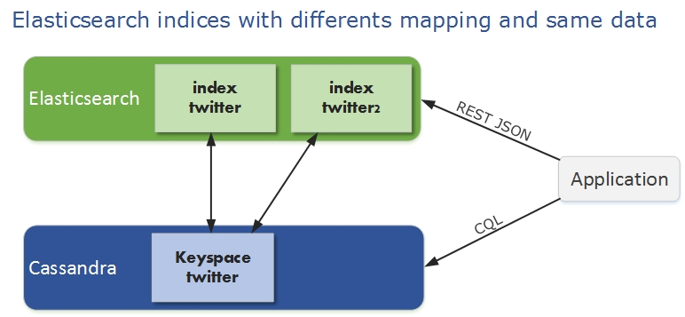
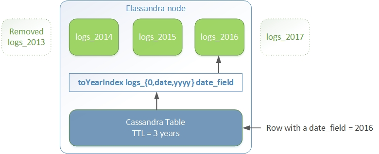

Document mapping
================

Basically, an Elasticsearch index is mapped to a cassandra keyspace, and a document type to a cassandra table.

Type mapping
------------

Here is the mapping from Elasticsearch field basic types to CQL3 types :

.. cssclass:: table-bordered

+----------------------+--------------------------+----------------------------+
| Elasticearch Types   | CQL Types                | Comment                    |
+======================+==========================+============================+
| string               | text                     |                            |
+----------------------+--------------------------+----------------------------+
| integer, short, byte | timestamp                |                            |
+----------------------+--------------------------+----------------------------+
| long                 | bigint                   |                            |
+----------------------+--------------------------+----------------------------+
| double               | double                   |                            |
+----------------------+--------------------------+----------------------------+
| float                | float                    |                            |
+----------------------+--------------------------+----------------------------+
| boolean              | boolean                  |                            |
+----------------------+--------------------------+----------------------------+
| binary               | blob                     |                            |
+----------------------+--------------------------+----------------------------+
| ip                   | inet                     | Internet address           |
+----------------------+--------------------------+----------------------------+
| geo_point            | UDT geo_point            | Built-In User Defined Type |
+----------------------+--------------------------+----------------------------+
| geo_shape            | UDT geo_shape            | **Not yet implemented**    |
+----------------------+--------------------------+----------------------------+
| object, nested       | Custom User Defined Type |                            |
+----------------------+--------------------------+----------------------------+

These parameters control the cassandra mapping.
   
.. cssclass:: table-bordered

+---------------------------+----------------------------+------------------------------------------------------------------------------------------------------------------------------------------------------------------------------------------------------------------------+
| Parameter                 | Values                     | Description                                                                                                                                                                                                            |
+===========================+============================+========================================================================================================================================================================================================================+
| ``cql_collection``        | **list**, set or singleton | Control how the field of type X is mapped to a column list<X>, set<X> or X. Default is **list** because Elasticsearch fields are multivalued.                                                                          |
+---------------------------+----------------------------+------------------------------------------------------------------------------------------------------------------------------------------------------------------------------------------------------------------------+
| ``cql_struct``            | **udt** or map             | Control how an object or nested field is mapped to a User Defined Type or to a cassandra map<text,?>. Default is **udt**.                                                                                              |
+---------------------------+----------------------------+------------------------------------------------------------------------------------------------------------------------------------------------------------------------------------------------------------------------+
| ``cql_mandatory``         | **true** or false          | Elasticsearch index full document. For partial CQL updates, this control which fields should be read to index a full document from a row. Default is **true** meaning that updates involve reading all missing fields. |
+---------------------------+----------------------------+------------------------------------------------------------------------------------------------------------------------------------------------------------------------------------------------------------------------+
| ``cql_primary_key_order`` | **integer**                | Field position in the cassandra the primary key of the underlying cassandra table. Default is **-1** meaning that the field is not part of the cassandra primary key.                                                  |
+---------------------------+----------------------------+------------------------------------------------------------------------------------------------------------------------------------------------------------------------------------------------------------------------+
| ``cql_partition_key``     | true or **false**          | When the cql_primary_key_order >= 0, specify if the field is part of the cassandra partition key. Default is **false** meaning that the field is not part of the cassandra partition key.                              |
+---------------------------+----------------------------+------------------------------------------------------------------------------------------------------------------------------------------------------------------------------------------------------------------------+

For more information about cassandra collection types and compound primary key, see `<https://docs.datastax.com/en/cql/3.1/cql/cql_using/use_collections_c.html>'_ and `<https://docs.datastax.com/en/cql/3.1/cql/ddl/ddl_compound_keys_c.html>`_.

Elasticsearch mapping from an existing cassandra table
------------------------------------------------------

A new put mapping parameter `discover` allow to create Elasticsearch mapping from an existing cassandra table. 
Columns matching the provided regular expression are mapped as Elasticsearch fields. 

The following command create the elasticsearch mapping for all columns starting by 'a' of the cassandra table *my_keyspace.my_table*.and set a specific analyzer for column *name*. 

.. code::

   curl -XPUT "http://localhost:9200/my_keyspace/_mapping/my_table" -d '{ 
       "my_table" : { 
           "discover" : "a.*",
           "properties" : {
               "name" : {
                   "type" : "string",
                   "index" : "analyzed"
               }
           }
       }
   }'

By default, all text columns are mapped with ``"index":"not_analyzed"``.

.. TIP::
   When creating the first Elasticsearch index for a given cassandra table, elassandra creates a custom CQL secondary index asynchonously for each mapped field when all shards are started. 
   Cassandra build index on all nodes for all existing data. Subsequent CQL inserts or updates are automatically indexed in Elasticsearch. 
   
   If you then add a second or more Elasticsearch indices to an existing indexed table, existing data are not automatically re-indexed because cassandra has already indexed existing data. 
   Instead of re-insert your data in the cassandra table, you may use the following command to force a cassandra index rebuild. It will re-index your cassandra table to all associated elasticsearch indices :
   
   .. code::
   
      nodetool rebuild_index <keyspace> <table> elastic_<table>
   
   When deleting an elasticsearch index, elasticsearch index files are removed form the data/elasticsearch.data directory, but cassandra secondary indices remains until the last associated elasticsearch index is removed.

Compound primary key support
----------------------------

When mapping an existing cassandra table to an Elasticsearch index, table name is a document type and primary key is mapped to the ``_id`` field as follow. 

* Single primary key is converted to a string.
* Compound primary key is converted to a JSON array stored as string in the ``_id`` field.

The elasticsearch ``_routing`` is mapped to the cassandra partition key with the same rule.

Indexing cassandra static columns
---------------------------------

In a table that use clustering columns, a [static columns](http://docs.datastax.com/en/cql/3.1/cql/cql_reference/refStaticCol.html) is shared by all the rows with the same partition key. A slight modification of cassandra code provides support of secondary index on static columns, allowing to search on static columns values (CQL search on static columns remains unsupported). Each time a static columns is modified, a document containing the partition key and only static columns is indexed in Elasticserach. Static columns are not indexed with every [wide rows](http://www.planetcassandra.org/blog/wide-rows-in-cassandra-cql/) because any update on a static column would require reindexation of all wide rows. However, you can request for fields backed by a static columns on any get/search request. 

The following example demonstrates how to use static columns to store meta information of timeseries.

.. code::

   curl -XPUT "http://localhost:9200/test" -d '{
      "mappings" : {
          "timeseries" : {
            "properties" : {
              "t" : {
                "type" : "date",
                "format" : "strict_date_optional_time||epoch_millis",
                "cql_primary_key_order" : 1,
                "cql_collection" : "singleton"
              },
              "meta" : {
                "type" : "nested",
                "cql_struct" : "map",
                "cql_static_column" : true,
                "cql_collection" : "singleton",
                "include_in_parent" : true,
                "properties" : {
                  "region" : {
                    "type" : "string"
                  }
                }
              },
              "v" : {
                "type" : "double",
                "cql_collection" : "singleton"
              },
              "m" : {
                "type" : "string",
                "cql_partition_key" : true,
                "cql_primary_key_order" : 0,
                "cql_collection" : "singleton"
              }
            }
          }
     }
   }'

   cqlsh <<EOF
   INSERT INTO test.timeseries (m, t, v) VALUES ('server1-cpu', '2016-04-10 13:30', 10);
   INSERT INTO test.timeseries (m, t, v) VALUES ('server1-cpu', '2016-04-10 13:31', 20);
   INSERT INTO test.timeseries (m, t, v) VALUES ('server1-cpu', '2016-04-10 13:32', 15);
   INSERT INTO test.timeseries (m, meta) VALUES ('server1-cpu', { 'region':'west' } );
   SELECT * FROM test.timeseries;
   EOF

    m           | t                           | meta               | v
   -------------+-----------------------------+--------------------+----
    server1-cpu | 2016-04-10 11:30:00.000000z | {'region': 'west'} | 10
    server1-cpu | 2016-04-10 11:31:00.000000z | {'region': 'west'} | 20
    server1-cpu | 2016-04-10 11:32:00.000000z | {'region': 'west'} | 15
 

Search for wide rows only where v=10 and fetch the meta.region field.

.. code::

   curl -XGET "http://$NODE:9200/test/timeseries/_search?pretty=true&q=v:10&fields=m,t,v,meta.region"

   "hits" : [ {
         "_index" : "test",
         "_type" : "timeseries",
         "_id" : "[\"server1-cpu\",1460287800000]",
         "_score" : 1.9162908,
         "_routing" : "server1-cpu",
         "fields" : {
           "meta.region" : [ "west" ],
           "t" : [ "2016-04-10T11:30:00.000Z" ],
           "m" : [ "server1-cpu" ],
           "v" : [ 10.0 ]
         }
       } ]

Search for rows where meta.region=west, returns only the partition key and static columns.

.. code::

   curl -XGET "http://$NODE:9200/test/timeseries/_search?pretty=true&q=meta.region:west&fields=m,t,v,meta.region"
   "hits" : {
       "total" : 1,
       "max_score" : 1.5108256,
       "hits" : [ {
         "_index" : "test",
         "_type" : "timeseries",
         "_id" : "server1-cpu",
         "_score" : 1.5108256,
         "_routing" : "server1-cpu",
         "fields" : {
           "m" : [ "server1-cpu" ],
           "meta.region" : [ "west" ]
         }
       } ] 

Mapping change with zero downtime
---------------------------------

You can map servral Elasticsearch indices with different mapping to the same cassandra keyspace. 
By default, an index is mapped to a keyspace with the same name, but you can specify a target ``keyspace`` in your index settings. 

For exemple, create a new index **twitter2** mapped to the cassandra keyspace **twitter** and set a mapping for type **tweet** associated to the existing cassandra table **twitter.tweet**. 

.. code::

   curl -XPUT "http://localhost:9200/twitter2/" -d '{ 
      "settings" : { "keyspace" : "twitter" } },
      "mappings" : {
         "tweet" : {
               "properties" : {
                 "message" : { "type" : "string", "index" : "not_analyzed" },
                 "post_date" : { "type" : "date", "format": "yyyy-MM-dd" },
                 "user" : { "type" : "string","index" : "not_analyzed" },
                 "size" : { "type" : "long" }
               }
         }
      }
   }

You can set a specific mapping for **twitter2** and re-index existing data on each cassandra node with the following command (indices are named **elastic_<tablename>**).

.. code::

   nodetool rebuild_index twitter tweet elastic_tweet

Once your **twitter2** index is ready, set an alias **twitter** for **twitter2** to switch from the old mapping to the new one, and delete the old **twitter** index.

.. code::

   curl -XPOST "http://localhost:9200/_aliases" -d '{ "actions" : [ { "add" : { "index" : "twitter2", "alias" : "twitter" } } ] }'
   curl -XDELETE "http://localhost:9200/twitter"

Object and Nested mapping
-------------------------

By default, Elasticsearch `object or nested types<https://www.elastic.co/guide/en/elasticsearch/reference/current/mapping-object-type.html>`_ are 
mapped to dynamically created Cassandra `User Defined Types <https://docs.datastax.com/en/cql/3.1/cql/cql_using/cqlUseUDT.html>`_. 

.. code::

   curl -XPUT 'http://localhost:9200/twitter/tweet/1' -d '{
        "user" : {
            "name" : {
                "first_name" : "Vincent",
                "last_name" : "Royer"
            },
            "uid" : "12345"
        },
        "message" : "This is a tweet!"
   }'
   
   curl -XGET 'http://localhost:9200/twitter/tweet/1/_source'
   {"message":"This is a tweet!","user":{"uid":["12345"],"name":[{"first_name":["Vincent"],"last_name":["Royer"]}]}}

The resulting cassandra user defined types and table.

.. code::

   cqlsh>describe keyspace twitter;
   CREATE TYPE twitter.tweet_user (
       name frozen<list<frozen<tweet_user_name>>>,
       uid frozen<list<text>>
   );
   
   CREATE TYPE twitter.tweet_user_name (
       last_name frozen<list<text>>,
       first_name frozen<list<text>>
   );
   
   CREATE TABLE twitter.tweet (
       "_id" text PRIMARY KEY,
       message list<text>,
       person list<frozen<tweet_person>>
   )
   
   cqlsh> select * from twitter.tweet;
   _id  | message              | user
   -----+----------------------+-----------------------------------------------------------------------------
   1 | ['This is a tweet!'] | [{name: [{last_name: ['Royer'], first_name: ['Vincent']}], uid: ['12345']}]
   

Dynamic mapping of cassandra map
--------------------------------

Nested document can be mapped to `User Defined Type <https://docs.datastax.com/en/cql/3.1/cql/cql_using/cqlUseUDT.html>`_ or to 
CQL `map <http://docs.datastax.com/en/cql/3.1/cql/cql_using/use_map_t.html#toc_pane>`_. 
In the following example, the cassandra map is automatically mapped with ``cql_mandatory:true``, so a partial CQL update cause a read of the whole map to re-index a document in the elasticsearch index. 

.. code::

   cqlsh>CREATE KEYSPACE IF NOT EXISTS twitter WITH replication={ 'class':'NetworkTopologyStrategy', 'dc1':'1' };
   cqlsh>CREATE TABLE twitter.user ( 
      name text,
      attrs map<text,text>,
      PRIMARY KEY (name)
   );
   cqlsh>INSERT INTO twitter.user (name,attrs) VALUES ('bob',{'email':'bob@gmail.com','firstname':'bob'});

Create the type mapping from the cassandra table and search for the *bob* entry.

.. code::

   curl -XPUT "http://localhost:9200/twitter/_mapping/user" -d '{ "user" : { "discover" : ".*" }}'
   {"acknowledged":true}
   
   curl -XGET 'http://localhost:9200/twitter/_mapping/user?pretty=true'
   {
     "twitter" : {
       "mappings" : {
         "user" : {
           "properties" : {
             "attrs" : {
               "type" : "nested",
               "cql_struct" : "map",
               "cql_collection" : "singleton",
               "properties" : {
                 "email" : {
                   "type" : "string"
                 },
                 "firstname" : {
                   "type" : "string"
                 }
               }
             },
             "name" : {
               "type" : "string",
               "cql_collection" : "singleton",
               "cql_partition_key" : true,
               "cql_primary_key_order" : 0
             }
           }
         }
       }
     }
   }

   curl -XGET "http://localhost:9200/twitter/user/bob?pretty=true"
   {
     "_index" : "twitter",
     "_type" : "user",
     "_id" : "bob",
     "_version" : 0,
     "found" : true,
     "_source":{"name":"bob","attrs":{"email":"bob@gmail.com","firstname":"bob"}}
   }

Now insert a new entry in the attrs map column and search for a nested field `attrs.city:paris`.

.. code::

   cqlsh>UPDATE twitter.user SET attrs = attrs + { 'city':'paris' } WHERE name = 'bob';

   curl -XGET "http://localhost:9200/twitter/_search?pretty=true" -d '{
   "query":{
       "nested":{ 
               "path":"attrs",
               "query":{ "match": {"attrs.city":"paris" } }
                }
           }
   }'
   {
     "took" : 3,
     "timed_out" : false,
     "_shards" : {
       "total" : 1,
       "successful" : 1,
       "failed" : 0
     },
     "hits" : {
       "total" : 1,
       "max_score" : 2.3862944,
       "hits" : [ {
         "_index" : "twitter",
         "_type" : "user",
         "_id" : "bob",
         "_score" : 2.3862944,
         "_source":{"attrs":{"city":"paris","email":"bob@gmail.com","firstname":"bob"},"name":"bob"}
       } ]
     }
   }

Parent-Child Relationship
-------------------------

Elassandra supports `parent-child relationship <https://www.elastic.co/guide/en/elasticsearch/guide/current/parent-child.html>`_ when parent and child document 
are located on the same cassandra node. This condition is met :

* when running a single node cluster, 
* when the keyspace replication factor equals the number of nodes or 
* when the parent and child documents share the same cassandra partition key, as shown in the folling exemple.

Create an index company (a cassandra keyspace), a cassandra table, insert 2 rows and map this table as document type employee.

.. code::

   cqlsh <<EOF
   CREATE KEYSPACE IF NOT EXISTS company WITH replication={ 'class':'NetworkTopologyStrategy', 'dc1':'1' };
   CREATE TABLE company.employee (
   "_parent" text,
   "_id" text,
   name text,
   dob timestamp,
   hobby text,
   primary key (("_parent"),"_id")
   );
   INSERT INTO company.employee ("_parent","_id",name,dob,hobby) VALUES ('london','1','Alice Smith','1970-10-24','hiking');
   INSERT INTO company.employee ("_parent","_id",name,dob,hobby) VALUES ('london','2','Alice Smith','1990-10-24','hiking');
   EOF
   
   curl -XPUT "http://$NODE:9200/company2" -d '{
      "settings": { "index.secondary_index_class":"org.elasticsearch.cassandra.index.ElasticSecondaryIndex" },
      "mappings" : {
       "employee" : {
               "discover" : ".*",
               "_parent"  : { "type": "branch", "cql_parent_pk":"branch" }
           }
       }
   }'
   curl -XPOST "http://127.0.0.1:9200/company/branch/_bulk" -d '
   { "index": { "_id": "london" }}
   { "district": "London Westminster", "city": "London", "country": "UK" }
   { "index": { "_id": "liverpool" }}
   { "district": "Liverpool Central", "city": "Liverpool", "country": "UK" }
   { "index": { "_id": "paris" }}
   { "district": "Champs Élysées", "city": "Paris", "country": "France" }
   '

Search for documents having chidren document of type *employee* with *dob* date geater than 1980.

.. code::

   curl -XGET "http://$NODE:9200/company2/branch/_search?pretty=true" -d '{
     "query": {
       "has_child": {
         "type": "employee",
         "query": {
           "range": {
             "dob": {
               "gte": "1980-01-01"
             }
           }
         }
       }
     }
   }'

Search for employee documents having a parent document where *country* match UK.

.. code::

   curl -XGET "http://$NODE:9200/company2/employee/_search?pretty=true" -d '{
     "query": {
       "has_parent": {
         "parent_type": "branch",
         "query": {
           "match": { "country": "UK"
           }
         }
       }
     }
   }'

Index partitionning
-------------------

TTL support is deprected since elasticsearch 2.0 and disbaled in elassandra. 
Rather than _ttl, elassandra support a partition functions allowing to manage per time-frame indices. Thus, old log data can be removed by simply deleting old indices.

An index partition function act as a filter when many indices are associated to a cassandra table. It relies on the java `MessageFormat <https://docs.oracle.com/javase/8/docs/api/java/text/MessageFormat.html>`_ to generate the index name.
In the following exemple, the *toYearIndex* function apply the date_field value to a pattern. 

