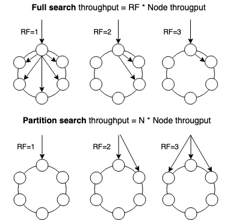
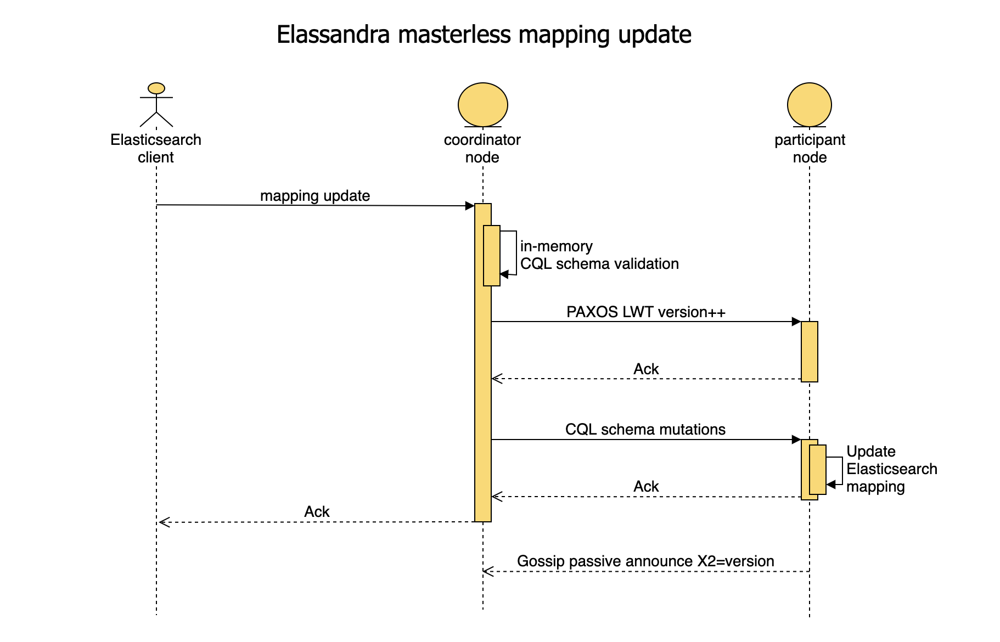

Architecture
============

Elassandra closely integrates Elasticsearch within Apache Cassandra as a secondary index, allowing near-realtime search with all existing Elasticsearch APIs, plugins and tools like Kibana.

When you index a document, the JSON document is stored as a row in a Cassandra table and synchronously indexed in Elasticsearch.

.. image:: images/elassandra1.jpg

Concepts Mapping
----------------

.. cssclass:: table-bordered

    +------------------------+--------------------+--------------------------------------------------------------------------+
    | Elasticsearch          | Cassandra          | Description                                                              |
    +========================+====================+==========================================================================+
    | Cluster                | Virtual Datacenter | All nodes of a datacenter forms an Elasticsearch cluster                 |
    +------------------------+--------------------+--------------------------------------------------------------------------+
    | Shard                  | Node               | Each Cassandra node is an Elasticsearch shard for each indexed keyspace  |
    +------------------------+--------------------+--------------------------------------------------------------------------+
    | Index                  | Keyspace           | An Elasticsearch index is backed by a keyspace                           |
    +------------------------+--------------------+--------------------------------------------------------------------------+
    | Type                   | Table              | Each Elasticsearch document type is backed by a Cassandra table.         |
    |                        |                    | Elasticsearch 6+ support only one document type, named "_doc" by default.|
    +------------------------+--------------------+--------------------------------------------------------------------------+
    | Document               | Row                | An Elasticsearch document is backed by a Cassandra row                   |
    +------------------------+--------------------+--------------------------------------------------------------------------+
    | Field                  | Cell               | Each indexed field is backed by a Cassandra cell (row x column)          |
    +------------------------+--------------------+--------------------------------------------------------------------------+
    | Object or nested field | User Defined Type  | Automatically create a User Defined Type to store an Elasticsearch object|
    +------------------------+--------------------+--------------------------------------------------------------------------+

From an Elasticsearch perspective :

* An Elasticsearch cluster is a Cassandra virtual datacenter.
* Every Elassandra node is a master primary data node.
* Each node only index local data and acts as a primary local shard.
* Elasticsearch data is no longer stored in Lucene indices, but in Cassandra tables.

  * An Elasticsearch index is mapped to a Cassandra keyspace,
  * Elasticsearch document type is mapped to a Cassandra table. Elasticsearch 6+ support only one document type, named "_doc" by default.
  * Elasticsearch document *_id* is a string representation of the Cassandra primary key.

* Elasticsearch discovery now relies on the cassandra `gossip protocol <https://wiki.apache.org/cassandra/ArchitectureGossip>`_. When a node joins or leaves the cluster, or when a schema change occurs, each node updates the nodes status and its local routing table.
* Elasticsearch `gateway <https://www.elastic.co/guide/en/elasticsearch/reference/current/modules-gateway.html>`_ now store metadata in a Cassandra table and in the Cassandra schema. Metadata updates are played sequentially through a `cassandra lightweight transaction <http://docs.datastax.com/en/cql/3.1/cql/cql_using/use_ltweight_transaction_t.html>`_. Metadata UUID is the cassandra hostId of the last modifier node.
* Elasticsearch REST and java API remain unchanged.
* Logging is now based on `logback <http://logback.qos.ch/>`_ as in Cassandra.

From a Cassandra perspective :

* Columns with an ElasticSecondaryIndex are indexed in Elasticsearch.
* By default, Elasticsearch document fields are multivalued, so every field is backed by a list. Single valued document field can be mapped to a basic types by setting 'cql_collection: singleton' in our type mapping. See `Elasticsearch document mapping <Elasticsearch-document-mapping>`_ for further details.
* Nested documents are stored using cassandra `User Defined Type <http://docs.datastax.com/en/cql/3.1/cql/cql_using/cqlUseUDT.html>`_ or `map <http://docs.datastax.com/en/cql/3.0/cql/cql_using/use_map_t.html>`_.
* Elasticsearch provides a JSON-REST API to cassandra, see `Elasticsearch API <https://www.elastic.co/guide/en/elasticsearch/reference/1.5/index.html>`_.

Durability
----------

All writes to a Cassandra node are recorded both in a memory table and in a commit log. When a memtable flush occurs, it flushes the elasticsearch secondary index on disk.
When restarting after a failure, Cassandra replays commitlogs and re-indexes elasticsearch documents that were not flushed by Elasticsearch.
This is the reason why `elasticsearch translog <https://www.elastic.co/guide/en/elasticsearch/reference/current/index-modules-translog.html#index-modules-translog>`_ is disabled in Elassandra.

Shards and Replicas
-------------------

Unlike Elasticsearch, sharding depends on the number of nodes in the datacenter, and the number of replica is defined by your keyspace `Replication Factor <http://docs.datastax.com/en/cassandra/2.0/cassandra/architecture/architectureDataDistributeReplication_c.html>`_ . Elasticsearch *numberOfShards* is just information about the number of nodes.

* When adding a new Elassandra node, the Cassandra boostrap process gets some token ranges from the existing ring and pull the corresponding data. Pulled data is automatically indexed and each node update its routing table to distribute search requests according to the ring topology.
* When updating the Replication Factor, you will need to run a `nodetool repair <keyspace> <http://docs.datastax.com/en/cql/3.0/cql/cql_using/update_ks_rf_t.html>`_ on the new node to effectively copy and index the data.
* If a node becomes unavailable, the routing table is updated on all nodes to route search requests on available nodes. The current default strategy routes search requests on primary token ranges' owner first, then to replica nodes when available. If some token ranges become unreachable, the cluster status is in red, otherwise cluster status is in yellow.

After starting a new Elassandra node, data and Elasticsearch indices are distributed on 2 nodes (with no replication).

.. code::

    nodetool status twitter
    Datacenter: DC1
    ===============
    Status=Up/Down
    |/ State=Normal/Leaving/Joining/Moving
    --  Address    Load       Tokens  Owns (effective)  Host ID                               Rack
    UN  127.0.0.1  156,9 KB   2       70,3%             74ae1629-0149-4e65-b790-cd25c7406675  RAC1
    UN  127.0.0.2  129,01 KB  2       29,7%             e5df0651-8608-4590-92e1-4e523e4582b9  RAC2

The routing table now distributes search request on 2 Elassandra nodes covering 100% of the ring.

.. code::

    curl -XGET 'http://localhost:9200/_cluster/state/?pretty=true'
    {
      "cluster_name" : "Test Cluster",
      "version" : 12,
      "master_node" : "74ae1629-0149-4e65-b790-cd25c7406675",
      "blocks" : { },
      "nodes" : {
        "74ae1629-0149-4e65-b790-cd25c7406675" : {
          "name" : "localhost",
          "status" : "ALIVE",
          "transport_address" : "inet[localhost/127.0.0.1:9300]",
          "attributes" : {
            "data" : "true",
            "rack" : "RAC1",
            "data_center" : "DC1",
            "master" : "true"
          }
        },
        "e5df0651-8608-4590-92e1-4e523e4582b9" : {
          "name" : "127.0.0.2",
          "status" : "ALIVE",
          "transport_address" : "inet[127.0.0.2/127.0.0.2:9300]",
          "attributes" : {
            "data" : "true",
            "rack" : "RAC2",
            "data_center" : "DC1",
            "master" : "true"
          }
        }
      },
      "metadata" : {
        "version" : 1,
        "uuid" : "e5df0651-8608-4590-92e1-4e523e4582b9",
        "templates" : { },
        "indices" : {
          "twitter" : {
            "state" : "open",
            "settings" : {
              "index" : {
                "creation_date" : "1440659762584",
                "uuid" : "fyqNMDfnRgeRE9KgTqxFWw",
                "number_of_replicas" : "1",
                "number_of_shards" : "1",
                "version" : {
                  "created" : "1050299"
                }
              }
            },
            "mappings" : {
              "user" : {
                "properties" : {
                  "name" : {
                    "type" : "string"
                  }
                }
              },
              "tweet" : {
                "properties" : {
                  "message" : {
                    "type" : "string"
                  },
                  "postDate" : {
                    "format" : "dateOptionalTime",
                    "type" : "date"
                  },
                  "user" : {
                    "type" : "string"
                  },
                  "_token" : {
                    "type" : "long"
                  }
                }
              }
            },
            "aliases" : [ ]
          }
        }
      },
      "routing_table" : {
        "indices" : {
          "twitter" : {
            "shards" : {
              "0" : [ {
                "state" : "STARTED",
                "primary" : true,
                "node" : "74ae1629-0149-4e65-b790-cd25c7406675",
                "token_ranges" : [ "(-8879901672822909480,4094576844402756550]" ],
                "shard" : 0,
                "index" : "twitter"
              } ],
              "1" : [ {
                "state" : "STARTED",
                "primary" : true,
                "node" : "e5df0651-8608-4590-92e1-4e523e4582b9",
                "token_ranges" : [ "(-9223372036854775808,-8879901672822909480]", "(4094576844402756550,9223372036854775807]" ],
                "shard" : 1,
                "index" : "twitter"
              } ]
            }
          }
        }
      },
      "routing_nodes" : {
        "unassigned" : [ ],
        "nodes" : {
          "e5df0651-8608-4590-92e1-4e523e4582b9" : [ {
            "state" : "STARTED",
            "primary" : true,
            "node" : "e5df0651-8608-4590-92e1-4e523e4582b9",
            "token_ranges" : [ "(-9223372036854775808,-8879901672822909480]", "(4094576844402756550,9223372036854775807]" ],
            "shard" : 1,
            "index" : "twitter"
          } ],
          "74ae1629-0149-4e65-b790-cd25c7406675" : [ {
            "state" : "STARTED",
            "primary" : true,
            "node" : "74ae1629-0149-4e65-b790-cd25c7406675",
            "token_ranges" : [ "(-8879901672822909480,4094576844402756550]" ],
            "shard" : 0,
            "index" : "twitter"
          } ]
        }
      },
      "allocations" : [ ]
    }

Internally, each node broadcasts its local shard status to the gossip application state X1 ( "twitter":STARTED ) and its current metadata UUID/version to the application state X2.

.. code::

    nodetool gossipinfo
    127.0.0.2/127.0.0.2
      generation:1440659838
      heartbeat:396197
      DC:DC1
      NET_VERSION:8
      SEVERITY:-1.3877787807814457E-17
      X1:{"twitter":3}
      X2:e5df0651-8608-4590-92e1-4e523e4582b9/1
      RELEASE_VERSION:2.1.8
      RACK:RAC2
      STATUS:NORMAL,-8879901672822909480
      SCHEMA:ce6febf4-571d-30d2-afeb-b8db9d578fd1
      INTERNAL_IP:127.0.0.2
      RPC_ADDRESS:127.0.0.2
      LOAD:131314.0
      HOST_ID:e5df0651-8608-4590-92e1-4e523e4582b9
    localhost/127.0.0.1
      generation:1440659739
      heartbeat:396550
      DC:DC1
      NET_VERSION:8
      SEVERITY:2.220446049250313E-16
      X1:{"twitter":3}
      X2:e5df0651-8608-4590-92e1-4e523e4582b9/1
      RELEASE_VERSION:2.1.8
      RACK:RAC1
      STATUS:NORMAL,-4318747828927358946
      SCHEMA:ce6febf4-571d-30d2-afeb-b8db9d578fd1
      RPC_ADDRESS:127.0.0.1
      INTERNAL_IP:127.0.0.1
      LOAD:154824.0
      HOST_ID:74ae1629-0149-4e65-b790-cd25c7406675

Write path
----------

Write operations (Elasticsearch index, update, delete and bulk operations) are converted into CQL write requests managed by the coordinator node.
The Elasticsearch document *_id* is converted into an underlying primary key, and the corresponding row is stored on many nodes according to the Cassandra replication factor.
Then, on each node hosting this row, an Elasticsearch document is indexed through a Cassandra custom secondary index. Every document includes a _token fields used when for searching.

.. image:: images/write-path.png

At index time, every node directly generates the Lucene fields without any JSON parsing overhead, and  the Lucene files do not contain any version number, because the version-based concurrency management becomes meaningless in a multi-master database like Cassandra.

Search path
-----------

Search request is done in two phases. First, the query phase, the coordinator node adds a token_ranges filter to the query and broadcasts a search request to all nodes. This token_ranges filter covers the entire Cassandra ring and avoids duplicating results.
Secondly, in the fetch phases, the coordinator fetches the required fields by issuing a CQL request in the underlying Cassandra table, and builds the final JSON response.

.. image:: images/search-path.png

By default, an Elassandra search request is sub-queried to all nodes in the datacenter. 
With the ``RandomSearchStrategy``, the coordinator node requests the minimum of nodes to cover the whole Cassandra ring depending on the Cassandra Replication Factor,
so this reduce the overall cost of a search and lower the CPU usage of nodes. 
For example, if you have a datacenter with four nodes and a replication factor of two, only two nodes will be requested
with simplified token_ranges filters (adjacent token ranges are automatically merged).

Additionally, as these token_ranges filters only change when the datacenter topology changes (for example when a node is down or when adding a new node), 
Elassandra introduces a token_range bitset cache for each Lucene segment.
With this cache, out of range documents are seen as deleted documents at the Lucene segment layer for subsequent 
queries using the same token_range filter. It drastically improves the search performances.

The CQL fetch overhead can also be mitigated by using keys and rows Cassandra caching, eventually using the off-heap caching features of Cassandra.

Finally, you can provide the Cassandra partition key as the routing parameter to route your search request to a Cassandra replica.

.. code::

	GET /books/_search?pretty&routing=xxx
	{ 
		“query":{ … }
	}

Elasticsearch query over CQL automatically adds routing when partition key is present:

.. code::

	SELECT * FROM books WHERE id=‘xxx’ AND es_query=’{"query":{ …}}'

Using partition search is definitely more scalable than full search on a datacenter:

Mapping and CQL schema management
---------------------------------

Elassandra has no master node to manage the Elasticsearch mapping and all nodes can update the Elasticsearch mapping. In order to manage concurrent simultaneous mapping and CQL schema changes, 
Elassandra plays a PAXOS transaction to update the current Elasticsearch metadata version in the Cassandra table **elastic_admin.metadata_log** tracking all mapping updates.
Here is the overall mapping update process including a PAXOS Light Weight Transaction and a CQL schema update:

Once the PAXOS transaction succeed, Elassandra coordinator node applies a batched-atomic (1) CQL schema update broadcasted to all nodes. 
Version number increase by one on each mapping update, and the **elastic_admin.metadata_log** tracks metadata update events, as shown in the following example.

.. code::

	SELECT * FROM elastic_admin.metadata_log;

	 cluster_name  | v    | version | owner                                | source                                          | ts
	---------------+------+---------+--------------------------------------+-------------------------------------------------+---------------------------------
	 trial_cluster | 4545 |    4545 | fc11f3b2-8280-4a69-af45-aaf1e9d336ae | delete-index [[index1574/q_xsELcBRFO2NITy62b6tg]] | 2019-09-16 15:06:31.054000+0000
	 trial_cluster | 4544 |    4545 | a1fdf359-a0a0-4fd1-ad6c-1d2605248560 | delete-index [[index1575/nsuu0CFiTkC2EH2gvLkXHw]] | 2019-09-16 15:02:44.511000+0000
	 trial_cluster | 4543 |    4545 | a1fdf359-a0a0-4fd1-ad6c-1d2605248560 | delete-index [[index2000/mEC5Bbx4T9m1ahi9LD1tIw]] | 2019-09-16 14:57:54.443000+0000
	 trial_cluster | 4542 |    4545 | a1fdf359-a0a0-4fd1-ad6c-1d2605248560 | delete-index [[index1576/sVaT7vjWS4e2ukuLoQNo_w]] | 2019-09-16 14:56:56.561000+0000
	 trial_cluster | 4541 |    4545 | a1fdf359-a0a0-4fd1-ad6c-1d2605248560 | delete-index [[index1570/DPmyeSB4Siyro9wbyEk9NA]] | 2019-09-16 14:55:59.507000+0000
	 trial_cluster | 4540 |    4545 | a1fdf359-a0a0-4fd1-ad6c-1d2605248560 |                       cql-schema-mapping-update | 2019-09-16 14:54:06.280000+0000
	 trial_cluster | 4539 |    4545 | a1fdf359-a0a0-4fd1-ad6c-1d2605248560 |           init table elastic_admin.metadata_log | 2019-09-16 14:44:57.243000+0000

.. TIP::

	The **elastic_admin.metadata_log** table contains one entry per metadata update event with a version number (column v), the host ID of the coordinator node (owner), 
	the event origin (source) and timestamp (ts). If PAXOS update timeout occurs, Elassandra reads this table to transparently recover. 
	If your cluster issues thousands of mapping updates, you should periodically delete old entries with a CQL range delete or add a default TTL to avoid an infinite growth.

All nodes sharing the same Elasticsearch mapping should have the same X2 value and you can check this with **nodetool gossipinfo**, as show here with X2 = e5df0651-8608-4590-92e1-4e523e4582b9/1.  

.. code::

    nodetool gossipinfo
    127.0.0.2/127.0.0.2
      generation:1440659838
      heartbeat:396197
      DC:DC1
      NET_VERSION:8
      SEVERITY:-1.3877787807814457E-17
      X1:{"twitter":3}
      X2:e5df0651-8608-4590-92e1-4e523e4582b9/1
      RELEASE_VERSION:2.1.8
      RACK:RAC2
      STATUS:NORMAL,-8879901672822909480
      SCHEMA:ce6febf4-571d-30d2-afeb-b8db9d578fd1
      INTERNAL_IP:127.0.0.2
      RPC_ADDRESS:127.0.0.2
      LOAD:131314.0
      HOST_ID:e5df0651-8608-4590-92e1-4e523e4582b9
    localhost/127.0.0.1
      generation:1440659739
      heartbeat:396550
      DC:DC1
      NET_VERSION:8
      SEVERITY:2.220446049250313E-16
      X1:{"twitter":3}
      X2:e5df0651-8608-4590-92e1-4e523e4582b9/1
      RELEASE_VERSION:2.1.8
      RACK:RAC1
      STATUS:NORMAL,-4318747828927358946
      SCHEMA:ce6febf4-571d-30d2-afeb-b8db9d578fd1
      RPC_ADDRESS:127.0.0.1
      INTERNAL_IP:127.0.0.1
      LOAD:154824.0
      HOST_ID:74ae1629-0149-4e65-b790-cd25c7406675

(1) All CQL changes involved by the Elasticsearch mapping update (CQL types and tables create/update) and the new Elasticsearch cluster state are applied in a *SINGLE* CQL schema update.
The Elasticsearch metadata are stored in a binary format in the CQL schema as table extensions, stored in **system_schema.tables**, column **extensions** of type *frozen<map<text, blob>>*. 

Elasticsearch metadata (indices, templates, aliases, ingest pipelines...) without document mapping is stored in **elastic_admin.metdata_log** table extensions:
 
.. code::

   admin@cqlsh> select keyspace_name, table_name, extensions from system_schema.tables where keyspace_name='elastic_admin';

    keyspace_name | table_name   | extensions
   ---------------+--------------+----------------------------------------------------------------------------------------------------------------------------------------------------------------------------------------------------------------------------------------------------------------------------------------------------------------------------------------------------------------------------------------------------------------------------------------------------------------------------------------------------------------------------------------------------------------------------------------------------------------------------------------------------------------------------------------------------------------------------------------------------------------------------------------------------------------------------------------------------------------------------
    elastic_admin | metadata_log | {'metadata': 0x3a290a05fa886d6574612d64617461fa8676657273696f6ec88b636c75737465725f757569646366303561333634362d636536662d346466642d396437642d3539323539336231656565658874656d706c61746573fafb86696e6469636573fa866d79696e646578fa41c4847374617465436f70656e8773657474696e6773fa92696e6465782e6372656174696f6e5f646174654c3135343431373539313438353992696e6465782e70726f76696465645f6e616d65466d79696e64657889696e6465782e75756964556e6f4336395237345162714e7147466f6f636965755194696e6465782e76657273696f6e2e637265617465644636303230333939fb86616c6961736573fafbfb83746f746ffa41c446436f70656e47fa484c313534343133353832303437354943746f746f4a554b59336f534a675a54364f48686e51396d676f5557514b4636303230333939fb4cfafbfbfb8e696e6465782d677261766579617264fa89746f6d6273746f6e6573f8f9fbfbfb, 'owner': 0xf05a3646ce6f4dfd9d7d592593b1eeee, 'version': 0x0000000000000004}
   
   (1 rows)

For each document type backed by a Cassandra table, index metadata including the mapping is stored as an extension, where extension key is elastic_admin/<index_name> :

.. code::

   admin@cqlsh> select keyspace_name, table_name, extensions from system_schema.tables where keyspace_name='myindex';
   
    keyspace_name | table_name | extensions
   ---------------+------------+-----------------------------------------------------------------------------------------------------------------------------------------------------------------------------------------------------------------
          myindex |     mytype | {'elastic_admin/myindex': 0x44464c00aa56caad2ca92c4855b2aa562a28ca2f482d2ac94c2d06f1d2f2f341144452a924b5a2444947292d333527052c9d9d5a599e5f9482a40426a2a394999e975f941a9f98945f06d46b646a560b0600000000ffff0300}
  

When snapshoting a keyspace or a table (ex: nodetool snapshot <keyspace>), Cassandra also backups the CQL schema (in <snapshot_dir>/schema.cql) including the Elasticsearch index metadata and mapping, and thus, 
restoring the CQL schema for an indexed table also restore the associated Elasticsearch index definition in the current cluster state.

.. TIP::

	You can decode the `SIMLE <https://github.com/FasterXML/smile-format-specification>`_ encoded mapping stored in table extensions by using the **elassandra-cli** utility, see :ref:`operations:tooling`.

