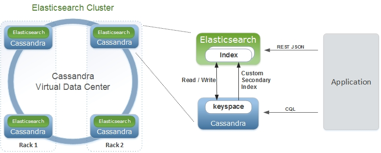
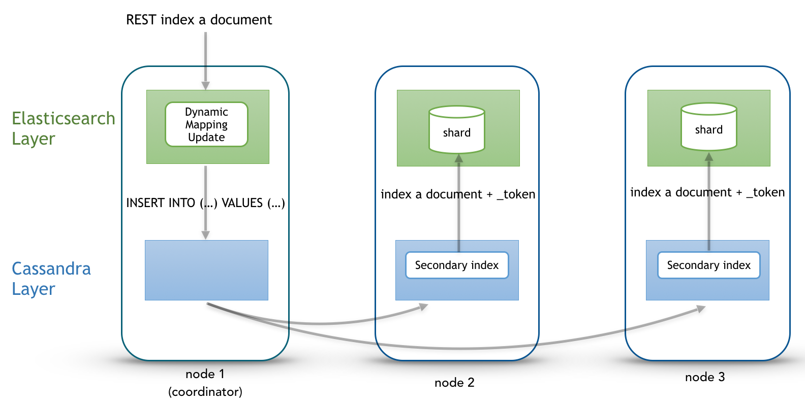
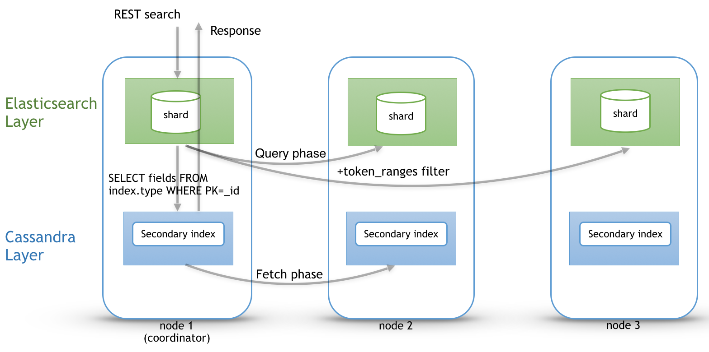

Architecture
============

Elassandra tightly integrates elasticsearch within cassandra as a secondary index, allowing near-realtime search with all existing elasticsearch APIs, plugins and tools like Kibana.

When you index a document, the JSON document is stored as a row in a cassandra table and synchronously indexed in elasticsearch.

Concepts Mapping
----------------

.. cssclass:: table-bordered

    +------------------------+--------------------+-------------------------------------------------------------------------+
    | Elasticsearch          | Cassandra          | Description                                                             |
    +========================+====================+=========================================================================+
    | Cluster                | Virtual Datacenter | All nodes of a datacenter forms an Elasticsearch cluster                |
    +------------------------+--------------------+-------------------------------------------------------------------------+
    | Shard                  | Node               | Each cassandra node is an elasticsearch shard for each indexed keyspace |
    +------------------------+--------------------+-------------------------------------------------------------------------+
    | Index                  | Keyspace           | An elasticsearch index is backed by a keyspace                          |
    +------------------------+--------------------+-------------------------------------------------------------------------+
    | Type                   | Table              | Each elasticsearch document type is backed by a cassandra table         |
    +------------------------+--------------------+-------------------------------------------------------------------------+
    | Document               | Row                | An elasticsearch document is backed by a cassandra row                  |
    +------------------------+--------------------+-------------------------------------------------------------------------+
    | Field                  | Cell               | Each indexed field is backed by a cassandra cell (row x column)         |
    +------------------------+--------------------+-------------------------------------------------------------------------+
    | Object or nested field | User Defined Type  | Automatically create User Defined Type to store elasticsearch object    |
    +------------------------+--------------------+-------------------------------------------------------------------------+

From an Elasticsearch perspective :

* An Elasticsearch cluster is a Cassandra virtual datacenter.
* Every Elassandra node is a master primary data node.
* Each node only index local data and acts as a primary local shard.
* Elasticsearch data is not more stored in lucene indices, but in cassandra tables.

  * An Elasticsearch index is mapped to a cassandra keyspace,
  * Elasticsearch document type is mapped to a cassandra table.
  * Elasticsearch document *_id* is a string representation of the cassandra primary key.

* Elasticsearch discovery now rely on the cassandra `gossip protocol <https://wiki.apache.org/cassandra/ArchitectureGossip>`_. When a node join or leave the cluster, or when a schema change occurs, each nodes update nodes status and its local routing table.
* Elasticsearch `gateway <https://www.elastic.co/guide/en/elasticsearch/reference/current/modules-gateway.html>`_ now store metadata in a cassandra table and in the cassandra schema. Metadata updates are played sequentially through a `cassandra lightweight transaction <http://docs.datastax.com/en/cql/3.1/cql/cql_using/use_ltweight_transaction_t.html>`_. Metadata UUID is the cassandra hostId of the last modifier node.
* Elasticsearch REST and java API remain unchanged.
* Logging is now based on `logback <http://logback.qos.ch/>`_ as cassandra.

From a Cassandra perspective :

* Columns with an ElasticSecondaryIndex are indexed in Elasticsearch.
* By default, Elasticsearch document fields are multivalued, so every field is backed by a list. Single valued document field can be mapped to a basic types by setting 'cql_collection: singleton' in our type mapping. See `Elasticsearch document mapping <Elasticsearch-document-mapping>`_ for details.
* Nested documents are stored using cassandra `User Defined Type <http://docs.datastax.com/en/cql/3.1/cql/cql_using/cqlUseUDT.html>`_ or `map <http://docs.datastax.com/en/cql/3.0/cql/cql_using/use_map_t.html>`_.
* Elasticsearch provides a JSON-REST API to cassandra, see `Elasticsearch API <https://www.elastic.co/guide/en/elasticsearch/reference/1.5/index.html>`_.

Durability
----------

All writes to a cassandra node are recorded both in a memory table and in a commit log. When a memtable flush occurs, it flushes the elasticsearch secondary index on disk.
When restarting after a failure, cassandra replays commitlogs and re-indexes elasticsearch documents that were no flushed by elasticsearch.
This the reason why `elasticsearch translog <https://www.elastic.co/guide/en/elasticsearch/reference/current/index-modules-translog.html#index-modules-translog>`_ is disabled in elassandra.

Shards and Replica
------------------

Unlike Elasticsearch, sharding depends on the number of nodes in the datacenter, and number of replica is defined by your keyspace `Replication Factor <http://docs.datastax.com/en/cassandra/2.0/cassandra/architecture/architectureDataDistributeReplication_c.html>`_ . Elasticsearch *numberOfShards* is just an information about number of nodes.

* When adding a new elasticassandra node, the cassandra boostrap process gets some token ranges from the existing ring and pull the corresponding data. Pulled data are automatically indexed and each node update its routing table to distribute search requests according to the ring topology.
* When updating the Replication Factor, you will need to run a `nodetool repair <keyspace> <http://docs.datastax.com/en/cql/3.0/cql/cql_using/update_ks_rf_t.html>`_ on the new node to effectively copy and index the data.
* If a node become unavailable, the routing table is updated on all nodes in order to route search requests on available nodes. The actual default strategy routes search requests on primary token ranges' owner first, then to replica nodes if available. If some token ranges become unreachable, the cluster status is red, otherwise cluster status is yellow.

After starting a new Elassandra node, data and elasticsearch indices are distributed on 2 nodes (with no replication).

.. code::

    nodetool status twitter
    Datacenter: DC1
    ===============
    Status=Up/Down
    |/ State=Normal/Leaving/Joining/Moving
    --  Address    Load       Tokens  Owns (effective)  Host ID                               Rack
    UN  127.0.0.1  156,9 KB   2       70,3%             74ae1629-0149-4e65-b790-cd25c7406675  RAC1
    UN  127.0.0.2  129,01 KB  2       29,7%             e5df0651-8608-4590-92e1-4e523e4582b9  RAC2

The routing table now distributes search request on 2 elasticassandra nodes covering 100% of the ring.

.. code::

    curl -XGET 'http://localhost:9200/_cluster/state/?pretty=true'
    {
      "cluster_name" : "Test Cluster",
      "version" : 12,
      "master_node" : "74ae1629-0149-4e65-b790-cd25c7406675",
      "blocks" : { },
      "nodes" : {
        "74ae1629-0149-4e65-b790-cd25c7406675" : {
          "name" : "localhost",
          "status" : "ALIVE",
          "transport_address" : "inet[localhost/127.0.0.1:9300]",
          "attributes" : {
            "data" : "true",
            "rack" : "RAC1",
            "data_center" : "DC1",
            "master" : "true"
          }
        },
        "e5df0651-8608-4590-92e1-4e523e4582b9" : {
          "name" : "127.0.0.2",
          "status" : "ALIVE",
          "transport_address" : "inet[127.0.0.2/127.0.0.2:9300]",
          "attributes" : {
            "data" : "true",
            "rack" : "RAC2",
            "data_center" : "DC1",
            "master" : "true"
          }
        }
      },
      "metadata" : {
        "version" : 1,
        "uuid" : "e5df0651-8608-4590-92e1-4e523e4582b9",
        "templates" : { },
        "indices" : {
          "twitter" : {
            "state" : "open",
            "settings" : {
              "index" : {
                "creation_date" : "1440659762584",
                "uuid" : "fyqNMDfnRgeRE9KgTqxFWw",
                "number_of_replicas" : "1",
                "number_of_shards" : "1",
                "version" : {
                  "created" : "1050299"
                }
              }
            },
            "mappings" : {
              "user" : {
                "properties" : {
                  "name" : {
                    "type" : "string"
                  }
                }
              },
              "tweet" : {
                "properties" : {
                  "message" : {
                    "type" : "string"
                  },
                  "postDate" : {
                    "format" : "dateOptionalTime",
                    "type" : "date"
                  },
                  "user" : {
                    "type" : "string"
                  },
                  "_token" : {
                    "type" : "long"
                  }
                }
              }
            },
            "aliases" : [ ]
          }
        }
      },
      "routing_table" : {
        "indices" : {
          "twitter" : {
            "shards" : {
              "0" : [ {
                "state" : "STARTED",
                "primary" : true,
                "node" : "74ae1629-0149-4e65-b790-cd25c7406675",
                "token_ranges" : [ "(-8879901672822909480,4094576844402756550]" ],
                "shard" : 0,
                "index" : "twitter"
              } ],
              "1" : [ {
                "state" : "STARTED",
                "primary" : true,
                "node" : "e5df0651-8608-4590-92e1-4e523e4582b9",
                "token_ranges" : [ "(-9223372036854775808,-8879901672822909480]", "(4094576844402756550,9223372036854775807]" ],
                "shard" : 1,
                "index" : "twitter"
              } ]
            }
          }
        }
      },
      "routing_nodes" : {
        "unassigned" : [ ],
        "nodes" : {
          "e5df0651-8608-4590-92e1-4e523e4582b9" : [ {
            "state" : "STARTED",
            "primary" : true,
            "node" : "e5df0651-8608-4590-92e1-4e523e4582b9",
            "token_ranges" : [ "(-9223372036854775808,-8879901672822909480]", "(4094576844402756550,9223372036854775807]" ],
            "shard" : 1,
            "index" : "twitter"
          } ],
          "74ae1629-0149-4e65-b790-cd25c7406675" : [ {
            "state" : "STARTED",
            "primary" : true,
            "node" : "74ae1629-0149-4e65-b790-cd25c7406675",
            "token_ranges" : [ "(-8879901672822909480,4094576844402756550]" ],
            "shard" : 0,
            "index" : "twitter"
          } ]
        }
      },
      "allocations" : [ ]
    }

Internally, each node broadcasts its local shard status in the gossip application state X1 ( "twitter":STARTED ) and its current metadata UUID/version in application state X2.

.. code::

    nodetool gossipinfo
    127.0.0.2/127.0.0.2
      generation:1440659838
      heartbeat:396197
      DC:DC1
      NET_VERSION:8
      SEVERITY:-1.3877787807814457E-17
      X1:{"twitter":3}
      X2:e5df0651-8608-4590-92e1-4e523e4582b9/1
      RELEASE_VERSION:2.1.8
      RACK:RAC2
      STATUS:NORMAL,-8879901672822909480
      SCHEMA:ce6febf4-571d-30d2-afeb-b8db9d578fd1
      INTERNAL_IP:127.0.0.2
      RPC_ADDRESS:127.0.0.2
      LOAD:131314.0
      HOST_ID:e5df0651-8608-4590-92e1-4e523e4582b9
    localhost/127.0.0.1
      generation:1440659739
      heartbeat:396550
      DC:DC1
      NET_VERSION:8
      SEVERITY:2.220446049250313E-16
      X1:{"twitter":3}
      X2:e5df0651-8608-4590-92e1-4e523e4582b9/1
      RELEASE_VERSION:2.1.8
      RACK:RAC1
      STATUS:NORMAL,-4318747828927358946
      SCHEMA:ce6febf4-571d-30d2-afeb-b8db9d578fd1
      RPC_ADDRESS:127.0.0.1
      INTERNAL_IP:127.0.0.1
      LOAD:154824.0
      HOST_ID:74ae1629-0149-4e65-b790-cd25c7406675

Write path
----------

Write operations (Elasticsearch index, update, delete and bulk operations) are converted to CQL write requests managed by the coordinator node.
The elasticsearch document *_id* is converted to the underlying primary key, and the corresponding row is stored on many nodes according to the Cassandra replication factor.
Then, on each node hosting this row, an Elasticsearch document is indexed through a Cassandra custom secondary index. Every document includes a _token fields used used when searching.

At index time, every nodes directly generates lucene fields without any JSON parsing overhead, and Lucene files does not contains any version number, because version-based concurrency management becomes meaningless in a multi-master database like Cassandra.

Search path
-----------

Search request is done in two phases. In the query phase, the coordinator node add a token_ranges filter to the query and broadcasts a search request to all nodes. This token_ranges filter covers all the Cassandra ring and avoid duplicate results.
Then, in the fetch phases, the coordinator fetches the required fields by issuing a CQL request in the underlying Cassandra table, and builds the final JSON response.

Adding a token_ranges filter to the original Elasticsearch query introduce an overhead in the query phase, and the more you have vnodes, the more this overhead increase with many OR clauses. To mitigates this overhead,
Elassandra provides a random search strategy requesting the minimum of nodes to cover the whole Cassandra ring. For example, if you have a datacenter with four nodes and a replication factor of two, it will request only two nodes
with simplified token_ranges filters (adjacent token ranges are automatically merged).

Additionnaly, as these token_ranges filters only change when the datacenter topology change (for example when a node is down or when adding a new node), Elassandra introduces a token_range bitset cache for each lucene segment.
With this cache, out of range documents are seen as deleted documents at the lucene segment layer for subsequent queries using the same token_range filter.
This drastically improves search performances.

Finally, the CQL fetch overhead can be mitigated by using keys and rows Cassandra caching, eventually using the off-heap caching features of Cassandra.

