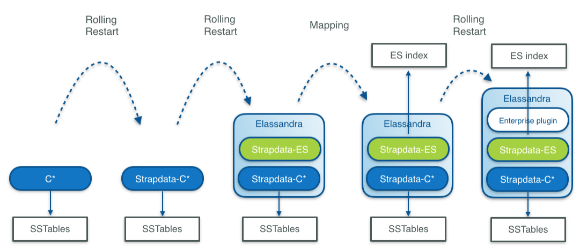
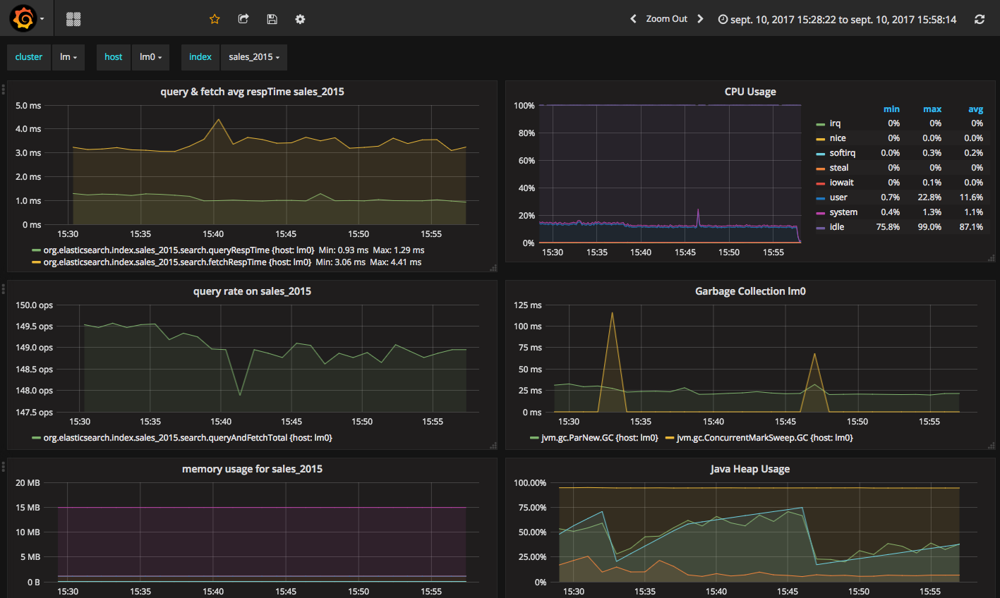
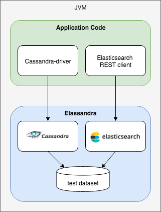
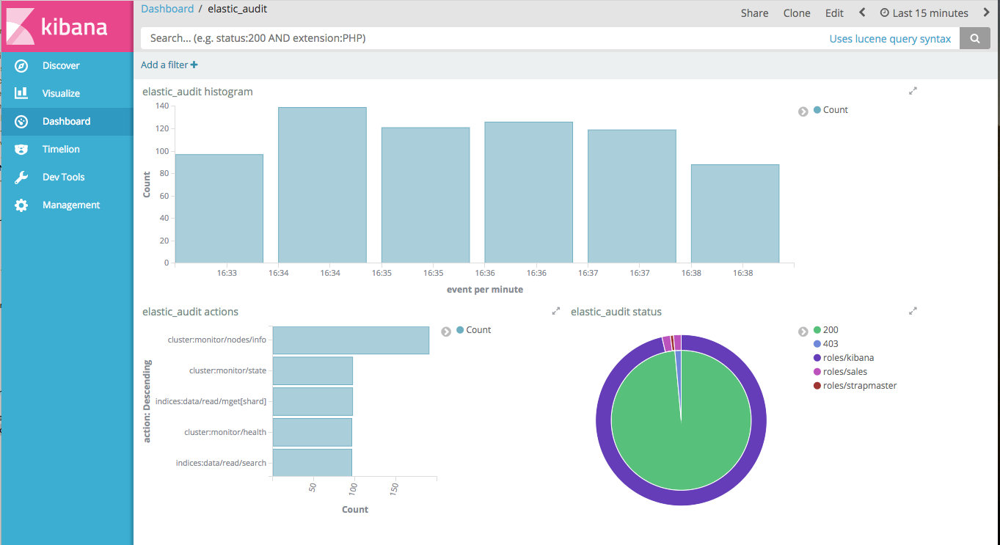

Enterprise
==========

Elassandra Enterprise is an Elasticsearch plugin installed on top of Elassandra community edition. Elassandra Enterprise plugin provides advanced features:

* Elasticsearch JMX management and monitoring.
* SSL encryption for Elasticsearch connections.
* Authentication, Authorization and Accounting for Elasticsearch.
* Elasticsearch Content-Based security (document-level security and field-level security).

If you are currently running a Cassandra cluster, you can progressively switch to Elassandra Enterprise by upgrading and activating Elasticsearch features:

* First switch to strapdata-cassandra, a fork of cassandra modified to support Elasticsearch.
* Second, restart nodes with Elasticsearch enabled (change the java main class).
* Third, create Elasticsearch indicies with a per table Elasticsearch mapping.
* And finally, deploy the Elassandra Enterprise plugin on your nodes to enable enterprise grade features.

Install
-------

The Elassandra Enterprise plugin must be installed on all Elassandra nodes:

* Unzip the strapdata-enterprise-<version>.zip in a temporary directory.
* If you have installed the elassandra tarball, set CASSANDRA_HOME to your install directory.
* Run the install.sh script.
* Enable some enterprise features in your conf/elasticsearch.yaml (For example add *jmx.enabled: true*)
* Start (or restart) your node.

To check that your *Strapdata Enterprise plugin* is active:

.. code::

   GET _nodes/plugins?pretty
   ...
   "plugins" : [
        {
          "name" : "org.apache.cassandra.service.ElassandraDaemon$ElassandraPlugin",
          "version" : "NA",
          "description" : "classpath plugin",
          "classname" : "org.apache.cassandra.service.ElassandraDaemon$ElassandraPlugin",
          "extended_plugins" : [ ],
          "has_native_controller" : false,
          "requires_keystore" : false
        },
        {
          "name" : "strapdata-plugin",
          "version" : "6.2.3.13",
          "description" : "Strapdata Enterprise plugin version 6.2.3.13",
          "classname" : "com.strapdata.elasticsearch.plugin.EnterprisePlugin",
          "extended_plugins" : [ ],
          "has_native_controller" : false,
          "requires_keystore" : false
        }
      ],
    ....

.. TIP::

   The Elassandra Enterprise plugin is active if at least one of its features is enabled in conf/elasticsearch.yml.

If you run in a container, the `strapdata/elassandra-enterprise <https://hub.docker.com/r/strapdata/elassandra-enterprise>`_ docker image has the Enterprise plugin installed.

License management
------------------

Enterprise plugin requires a valid license. When you start your first node with the Enterprise plugin enabled, a 30 days license is generated with all features enabled.
If you need more time to evaluate the product, you can request another 30 day license free of charge or purchase a souscription
including technical support for Elassandra. If your license has expired, the enterprise plugin will operate in a restricted mode until a valid
license is installed.

.. cssclass:: table-bordered

+---------+----------------------------------------------+---------------------------------------------------------------------------------+
| Feature | Description                                  | Restricted mode                                                                 |
+=========+==============================================+=================================================================================+
| JMX     | JMX monotoring of Elasticsearch indices      | Node restart required to see new index metrics, JMX attributes become read-only |
+---------+----------------------------------------------+---------------------------------------------------------------------------------+
| SSL     | SSL encryption of Elasticsearch connections  |                                                                                 |
+---------+----------------------------------------------+---------------------------------------------------------------------------------+
| AAA     | User Authentication, Authorization and Audit | Node restart required to reload users'privileges, no more audit trails.         |
+---------+----------------------------------------------+---------------------------------------------------------------------------------+
| CBS     | Content-Based Security rules                 | Node restart required to reload users'privileges.                               |
+---------+----------------------------------------------+---------------------------------------------------------------------------------+

.. CAUTION::

   If the number of nodes of licensed datacenters becomes greater than your license maximum number of nodes, then the license becomes invalid on all your nodes.
   
License installation
....................

Licenses are stored in a Cassandra table ``elastic_admin.licenses``. You can also put a **conf/license.json** file, this file is automatically loaded at boot time if ``elastic_admin.licenses`` is empty.

.. code::

   cassandra@cqlsh> select * from elastic_admin.licenses;
   
    id                                   | clustername | company | datacenters | email           | expire                          | features                     | generated                       | issuer    | maxnodes | production | signature                                                                                      | start                           | type
   --------------------------------------+-------------+---------+-------------+-----------------+---------------------------------+------------------------------+---------------------------------+-----------+----------+------------+------------------------------------------------------------------------------------------------+---------------------------------+-------
    bbbef903-bbea-401d-838d-faf696e53547 | TestCluster | thecorp |     ['DC1'] | contact@thecorp | 2018-10-01 22:00:00.000000+0000 | ['JMX', 'SSL', 'AAA', 'CBS'] | 2017-10-02 13:23:09.227000+0000 | Strapdata |        3 |      False | 0x302c02141404c757c3d0e387a8f6194669d5b0a677fbb82102145b88c2785ffabc26b3aa9df72ba03b65f4a829fe | 2017-10-01 22:00:00.000000+0000 | TRIAL

Checking your license
.....................

You can use the REST license API to check the currently active license. If your current configuration requires SSL encryption and user authentication,
you must provide a valid login, password and root CA certificate.

.. code::

   $ curl --user <username>:<password> --cacert conf/cacert.pem -XGET "https://localhost:9200/_license?pretty"
   {
     "id" : "bbbef903-bbea-401d-838d-faf696e53547",
     "issuer" : "Strapdata",
     "company" : "thecorp",
     "email" : "contact@thecorp",
     "generated" : "2017-10-02T13:23:09.227Z",
     "start" : "2017-10-01T22:00:00.000Z",
     "expire" : "2018-10-01T22:00:00.000Z",
     "production" : false,
     "max_nodes" : 3,
     "cluster_name" : "TestCluster",
     "datacenters" : [
       "DC1"
     ],
     "type" : "TRIAL",
     "features" : [
       "JMX",
       "SSL",
       "AAA",
       "CBS"
     ],
     "status" : "valid",
     "signature" : "0x302c02141404c757c3d0e387a8f6194669d5b0a677fbb82102145b88c2785ffabc26b3aa9df72ba03b65f4a829fe"
   }

Upgrading your license
......................

You can update your licence by inserting additional license row in the Cassandra ``elastic_admin.licenses`` table.

.. code::

   cassandra@cqlsh> INSERT INTO elastic_admin.licenses JSON '{"id":"bb0a181c-dbc6-4255-8d69-67b6e1d276ce","issuer":"Strapdata","company":"thecorp","email":"contact@thecorp","type":"TRIAL","features":["JMX","SSL","AAA"],"production":false,"generated":"2017-09-26 09:10:15.604Z","start":"2017-09-25 22:00:00.000Z","expire":"2018-09-25 22:00:00.000Z","clustername":"TestCluster","datacenters":["DC1"],"maxnodes":1,"signature":"0x302d02140b49e8c00b3606c66fe22378acb1ab781410460d02150092b666041dd97887b7d624fd6a12bbd434a955ed"}';

Then reload the license with a POST REST request as shown below, each node returns to its active license If you have several licenses in ``elastic_admin.licenses``, the **most recenlty generated valid** license will be used.

.. code::

   $ curl --user <username>:<password> --cacert <path/to/cacert.pem> -XPOST "https://localhost:9200/_license?pretty"
   {
     "_nodes" : {
       "total" : 2,
       "successful" : 2,
       "failed" : 0
     },
     "cluster_name" : "TestCluster",
     "nodes" : {
       "d607917d-8c68-4cc5-8dc2-2aa21f5ea986" : {
         "name" : "127.0.0.2",
         "license_id" : "bbbef903-bbea-401d-838d-faf696e53547"
       },
       "a1c5307c-5f5a-4676-a6f0-50f221dd655b" : {
         "name" : "127.0.0.1",
         "license_id" : "bbbef903-bbea-401d-838d-faf696e53547"
       }
     }
   }

.. TIP::

   If you have several Elasticsearch clusters in your Cassandra cluster, reload the license for each datacenter where Elasticsearch has been enabled.

JMX Managment & Monitoring
--------------------------

The `JMX <http://www.oracle.com/technetwork/java/javase/tech/javamanagement-140525.html>`_ technology provides a standard solution for managing and monitoring java applications. 
With the JMX feature, you can manage and monitor both Cassandra and Elasticsearch.

JMX Monitoring
..............

The JMX feature of Elassandra Enterprise exposes Elasticsearch stats over JMX, allowing monitoring the Elasticsearch cluster, index shards, threadpool and networks activities.
You can browse these metrics with various JMX clients lsuch as `VisualVM <https://visualvm.github.io/>`_ or `jmxterm <http://wiki.cyclopsgroup.org/jmxterm/>`_.

JMXTerm example :

.. code::

   java -jar jmxterm-1.0.0-uber.jar -l localhost:7199
   $>domain org.elasticsearch.index
   #domain is set to org.elasticsearch.index
   $>bean org.elasticsearch.index:name=sales_2017,scope=search,type=IndexShard
   #bean is set to org.elasticsearch.index:name=sales_2017,scope=search,type=IndexShard
   $>get *
   #mbean = org.elasticsearch.index:name=sales_2017,scope=search,type=IndexShard:
   QueryTotal = 21;
   FetchTotal = 0;
   ScrollTotal = 0;
   QueryTimeInMillis = 56038;
   QueryCurrent = 0;
   FetchTimeInMillis = 0;
   FetchCurrent = 0;
   ScrollTimeInMillis = 0;
   ScrollCurrent = 0;
   SuggestCount = 0;
   SuggestTimeInMillis = 0;
   SuggestCurrent = 0;
   $>

These metrcis can be pulled, or pushed to various tools (`graphite <http://graphite.readthedocs.io/en/latest/>`_, 
`ganglia <http://ganglia.info/>`_ or `influxdb <https://www.influxdata.com/>`_) using the popular `Metrics Library <http://metrics.dropwizard.io/3.2.3/getting-started.html>`_ embedded in Apache Cassandra.

Monitoring Elassandra with InfluxDB
...................................

Below is a sample configuration located in **conf/influxdb-reporting.yaml** sending JMX metrics to an InfluxDB database named *elassandra*. 

.. code::

   influxdb:
   -
     dbName: 'elassandra'
     protocol: 'http'
     tags:
       environment: 'test'         
       cluster: 'test_cluster'
       host: 'vm1'
     hosts:
       - host: 'vm1'
         port: 8086
     timeunit: 'SECONDS'
     period: 60
     prefix: ''
     groupGauges: true

To enable this configuration, add **JVM_OPTS="$JVM_OPTS -Dcassandra.metricsReporterConfigFile=influxdb-reporting.yaml"** in your **conf/cassandra-env.sh**

.. note::

   When installing the Elassandra Enterprise plugin, the following jar files are added to the cassandra classpath :
   
     * `reporter-config-base-3.0.4.jar <https://github.com/strapdata/metrics-reporter-config/releases/download/v3.0.4-strapdata/reporter-config-base-3.0.4.jar>`_
     * `reporter-config3-3.0.4.jar <https://github.com/strapdata/metrics-reporter-config/releases/download/v3.0.4-strapdata/reporter-config3-3.0.4.jar>`_
     * `metrics-influxdb-1.1.10-SNAPSHOT.jar <https://github.com/strapdata/dropwizard-metrics-influxdb/releases/download/v1.1.10-SNAPSHOT-strapdata/metrics-influxdb-1.1.10-SNAPSHOT.jar>`_
     * `dropwizard-metrics-influxdb-1.1.10-SNAPSHOT.jar <https://github.com/strapdata/dropwizard-metrics-influxdb/releases/download/v1.1.10-SNAPSHOT-strapdata/dropwizard-metrics-influxdb-1.1.10-SNAPSHOT.jar>`_

Then configure Grafana with an influxDB datasource and build your Elassandra dashboard.

Monitoring Elassandra with Prometheus
.....................................

`Prometheus <https://.io/>`_ can scrape both Elasticsearch and Cassandra JMX metrics through the standrard `Prometheus JMX Exporter <https://github.com/prometheus/jmx_exporter>`_ running as a java agent.
To expose these metrics on TCP port 7500,  add the following in your environnment or in the conf/cassandra-env.sh:

.. code ::

   JVM_OPTS="$JVM_OPTS -javaagent:agents/jmx_prometheus_javaagent-0.3.1.jar=7500:conf/jmx_prometheus_exporter.yml"

Here is the default JMX exporter configuration file **conf/jmx_prometheus_exporter.yml** for Elassandra.

.. code::

   lowercaseOutputName: true
   lowercaseOutputLabelNames: true
   whitelistObjectNames: [
   "org.apache.cassandra.metrics:type=ColumnFamily,name=RangeLatency,*",
   "org.apache.cassandra.metrics:type=ColumnFamily,name=LiveSSTableCount,*",
   "org.apache.cassandra.metrics:type=ColumnFamily,name=SSTablesPerReadHistogram,*",
   "org.apache.cassandra.metrics:type=ColumnFamily,name=SpeculativeRetries,*",
   "org.apache.cassandra.metrics:type=ColumnFamily,name=MemtableOnHeapSize,*",
   "org.apache.cassandra.metrics:type=ColumnFamily,name=MemtableSwitchCount,*",
   "org.apache.cassandra.metrics:type=ColumnFamily,name=MemtableLiveDataSize,*",
   "org.apache.cassandra.metrics:type=ColumnFamily,name=MemtableColumnsCount,*",
   "org.apache.cassandra.metrics:type=ColumnFamily,name=MemtableOffHeapSize,*",
   "org.apache.cassandra.metrics:type=ColumnFamily,name=BloomFilterFalsePositives,*",
   "org.apache.cassandra.metrics:type=ColumnFamily,name=BloomFilterFalseRatio,*",
   "org.apache.cassandra.metrics:type=ColumnFamily,name=BloomFilterDiskSpaceUsed,*",
   "org.apache.cassandra.metrics:type=ColumnFamily,name=BloomFilterOffHeapMemoryUsed,*",
   "org.apache.cassandra.metrics:type=ColumnFamily,name=SnapshotsSize,*",
   "org.apache.cassandra.metrics:type=ColumnFamily,name=TotalDiskSpaceUsed,*",
   "org.apache.cassandra.metrics:type=CQL,name=RegularStatementsExecuted,*",
   "org.apache.cassandra.metrics:type=CQL,name=PreparedStatementsExecuted,*",
   "org.apache.cassandra.metrics:type=Compaction,name=PendingTasks,*",
   "org.apache.cassandra.metrics:type=Compaction,name=CompletedTasks,*",
   "org.apache.cassandra.metrics:type=Compaction,name=BytesCompacted,*",
   "org.apache.cassandra.metrics:type=Compaction,name=TotalCompactionsCompleted,*",
   "org.apache.cassandra.metrics:type=ClientRequest,name=Latency,*",
   "org.apache.cassandra.metrics:type=ClientRequest,name=Unavailables,*",
   "org.apache.cassandra.metrics:type=ClientRequest,name=Timeouts,*",
   "org.apache.cassandra.metrics:type=Storage,name=Exceptions,*",
   "org.apache.cassandra.metrics:type=Storage,name=TotalHints,*",
   "org.apache.cassandra.metrics:type=Storage,name=TotalHintsInProgress,*",
   "org.apache.cassandra.metrics:type=Storage,name=Load,*",
   "org.apache.cassandra.metrics:type=Connection,name=TotalTimeouts,*",
   "org.apache.cassandra.metrics:type=ThreadPools,name=CompletedTasks,*",
   "org.apache.cassandra.metrics:type=ThreadPools,name=PendingTasks,*",
   "org.apache.cassandra.metrics:type=ThreadPools,name=ActiveTasks,*",
   "org.apache.cassandra.metrics:type=ThreadPools,name=TotalBlockedTasks,*",
   "org.apache.cassandra.metrics:type=ThreadPools,name=CurrentlyBlockedTasks,*",
   "org.apache.cassandra.metrics:type=DroppedMessage,name=Dropped,*",
   "org.apache.cassandra.metrics:type=Cache,scope=KeyCache,name=HitRate,*",
   "org.apache.cassandra.metrics:type=Cache,scope=KeyCache,name=Hits,*",
   "org.apache.cassandra.metrics:type=Cache,scope=KeyCache,name=Requests,*",
   "org.apache.cassandra.metrics:type=Cache,scope=KeyCache,name=Entries,*",
   "org.apache.cassandra.metrics:type=Cache,scope=KeyCache,name=Size,*",
   "org.apache.cassandra.metrics:type=Streaming,name=TotalIncomingBytes,*",
   "org.apache.cassandra.metrics:type=Streaming,name=TotalOutgoingBytes,*",
   "org.apache.cassandra.metrics:type=Client,name=connectedNativeClients,*",
   "org.apache.cassandra.metrics:type=Client,name=connectedThriftClients,*",
   "org.apache.cassandra.metrics:type=Table,name=WriteLatency,*",
   "org.apache.cassandra.metrics:type=Table,name=ReadLatency,*",
   "org.apache.cassandra.net:type=FailureDetector,*",
   "org.elasticsearch.cluster:*",
   "org.elasticsearch.node:*",
   "org.elasticsearch.index:*"
   ]
   #blacklistObjectNames: ["org.apache.cassandra.metrics:type=ColumnFamily,*"]
   rules:
     - pattern: org.apache.cassandra.metrics<type=(Connection|Streaming), scope=(\S*), name=(\S*)><>(Count|Value)
       name: cassandra_$1_$3
       labels:
         address: "$2"
     - pattern: org.apache.cassandra.metrics<type=(ColumnFamily), name=(RangeLatency)><>(Mean)
       name: cassandra_$1_$2_$3
     - pattern: org.apache.cassandra.net<type=(FailureDetector)><>(DownEndpointCount)
       name: cassandra_$1_$2
     - pattern: org.apache.cassandra.metrics<type=(Keyspace), keyspace=(\S*), name=(\S*)><>(Count|Mean|95thPercentile)
       name: cassandra_$1_$3_$4
       labels:
         "$1": "$2"
     - pattern: org.apache.cassandra.metrics<type=(Table), keyspace=(\S*), scope=(\S*), name=(\S*)><>(Count|Mean|95thPercentile)
       name: cassandra_$1_$4_$5
       labels:
         "keyspace": "$2"
         "table": "$3"
     - pattern: org.apache.cassandra.metrics<type=(ClientRequest), scope=(\S*), name=(\S*)><>(Count|Mean|95thPercentile)
       name: cassandra_$1_$3_$4
       labels:
         "type": "$2"
     - pattern: org.apache.cassandra.metrics<type=(\S*)(?:, ((?!scope)\S*)=(\S*))?(?:, scope=(\S*))?, name=(\S*)><>(Count|Value)
       name: cassandra_$1_$5
       labels:
         "$1": "$4"
         "$2": "$3"
     - pattern: org.elasticsearch.cluster<name=([a-zA-Z_ 0-9]+)><>(MetadataVersion|ClusterStateVersion|NumberOfPendingTasks|MaxTaskWaitTimeMillis|AliveNodeCount|DeadNodeCount)
       type: GAUGE
       name: elasticsearch_cluster_$2
     - pattern: org.elasticsearch.node<type=(transport)><>(\w*)
       name: elasticsearch_node_$1_$2
     - pattern: org.elasticsearch.node<type=(threadPool), name=(\S*)><>(\w*)
       name: elasticsearch_node_$1_$3
       type: GAUGE
       labels:
         "name": $2
     - pattern: org.elasticsearch.node<type=(httpServer)><>(\w*)
       type: COUNTER
       name: elasticsearch_node_$1_$2
       type: GAUGE
     - pattern: org.elasticsearch.index<type=(Index), name=(\S*)><>(IndexStatusCode)
       type: GAUGE
       name: elasticsearch_$1_$3
       labels:
         "name": $2
     - pattern: org.elasticsearch.index<type=(IndexShard), scope=(\S*)><>(\w*InBytes)
       type: GAUGE
       name: elasticsearch_$1_$3
       labels:
         "scope": $2
     - pattern: org.elasticsearch.index<type=(IndexShard), scope=(\S*)><>(\w*)
       type: COUNTER
       name: elasticsearch_$1_$3
       labels:
         "scope": $2
     - pattern: org.elasticsearch.index<type=(IndexShard), name=(\S*), scope=(\S*)><>(\w*InBytes)
       type: GAUGE
       name: elasticsearch_$1_$4
       labels:
         "index": $2
         "scope": $3
     - pattern: org.elasticsearch.index<type=(IndexShard), name=(\S*), scope=(\S*)><>(\w*)
       type: COUNTER
       name: elasticsearch_$1_$4
       labels:
         "index": $2
         "scope": $3

Then configure Grafana with a Prometheus datasource and build your Elassandra dashboard.

.. image:: images/grafana-prometheus-dashboard.png

Monitoring Elassandra through the Prometheus Operator
.....................................................

When running Elassandra Enterprise under Kubernetes, you can use the Prometheus-Operator <https://coreos.com/operators/prometheus/docs/latest/>`_ to monitor your Elassandra PODs.

Add the following annotations to automatically scrap Elassandra pods:

.. code-block:: yaml

   annotations.prometheus.io/scrape=true
   annotations.prometheus.io/port=7500

Add the following kubernetes labels to your Elassandra PODs:

.. code-block:: yaml

   release: "my-release"
   cluster: "my-cluster"
   datacenter: "DC1"

If you deploy Elassandra through the Elassandra HELM chart <https://github.com/strapdata/helm-charts>`_, the **release** label is automatically added to your Elassandra PODs.

In your Prometheus Operator (in HELM values.yaml, prometheusSpec.additionalScrapeConfigs), add the following scrap config to properly map Kubernetes pod's labels to Grafana dashboard variables:

.. code-block:: yaml

   prometheusSpec:
     additionalScrapeConfigs:
       - job_name: 'kubernetes-pods'
         kubernetes_sd_configs:
         - role: pod
         relabel_configs:
         - source_labels: [__meta_kubernetes_pod_annotation_prometheus_io_scrape]
           action: keep
           regex: true
         - source_labels: [__meta_kubernetes_pod_annotation_prometheus_io_path]
           action: replace
           target_label: __metrics_path__
           regex: (.+)
         - source_labels: [__address__, __meta_kubernetes_pod_annotation_prometheus_io_port]
           action: replace
           regex: ([^:]+)(?::\d+)?;(\d+)
           replacement: $1:$2
           target_label: __address__
         - action: labelmap
           regex: __meta_kubernetes_pod_label_(.+)
         - source_labels: [__meta_kubernetes_namespace]
           action: replace
           target_label: kubernetes_namespace
         - source_labels: [__meta_kubernetes_pod_name]
           action: replace
           target_label: kubernetes_pod_name
         - source_labels: [__meta_kubernetes_pod_name]
           action: replace
           target_label: instance

As the result, check that your Elassandra PODs have the expected tags in your Prometheus targets (release, cluster, datacenter and instance).

Finally, upload the `elassandra-kubernetes-dashborad.json <https://github.com/strapdata/elassandra-grafana-dashboard/blob/master/elassandra-kubernetes-dashboard.json>`_ through the `Grafana import wizard <http://docs.grafana.org/features/export_import/#import>`_.

Enable/Disable search on a node
...............................

The JMX feature allows excluding/including a node from distributed search while still receiving CQL write, repairing or rebuilding its elasticsearch indices, by
setting the following attributes on the JMX Bean ``org.elasticsearch.node:type=node``

.. cssclass:: table-bordered

+----------------------+---------------+-------------------------------------------------------------------------------------------------------------+
| JMX Attribute        | Default value | Description                                                                                                 |
+======================+===============+=============================================================================================================+
| ``SearchEnabled``    | **true**      | Set wether or not the node is invloved in distributed search queries from other nodes.                      |
|                      |               | When ``SearchEnabled`` is false on a node, all its shards are seen UNASSIGNED from other nodes.             |
+----------------------+---------------+-------------------------------------------------------------------------------------------------------------+
| ``AutoEnableSearch`` | **true**      | If true, the node automatically set ``SearchEnabled`` to true when it becomes available,                    |
|                      |               | participating to distributed search queries. In order to restart a node in a maintenance mode for search    |
|                      |               | requests, you can set ``AutoEnableSearch`` to **false** with the system property ``es.auto_enable_search``. |
+----------------------+---------------+-------------------------------------------------------------------------------------------------------------+

To set ``SearchEnabled`` on command line, just use **jmxterm** as in the following exemple.

.. code::

   echo "set -b org.elasticsearch.node:type=node SearchEnabled false" | java -jar jmxterm-1.0.0-uber.jar -l localhost:7199

SSL Network Encryption
----------------------

The SSL Feature provides trafic encryption for both HTTP and Elasticsearch transport connections.

.. note::

   Elasticsearch transport protocol is the native binary protocol used for Elasticsearch node-to-node communication. You can also use the 
   transport protocol from a client application written in java, as described in the `elasticsearch documentation <https://www.elastic.co/guide/en/elasticsearch/client/java-api/5.5/transport-client.html>`_.

SSL configuration is defined in your **conf/cassandra.yaml** for both Cassandra and Elasticsearch :

* Server options define node-to-node encryption for both Cassandra and Elasticsearch. Obviously, Elasticsearch transport connections are encrypted when *internode_encryption* is set to **all** or **rack** (there is no elasticsearch cross-datacenter traffic).
* Client options define client-to-node encryption to request both Cassandra and Elasticsearch. If *optional* is **true**, Elasticsearch will accept the clear connections for HTTP and transport request.

To ensure support for all encryption algorithms, it is highly recommended to install the `JCE Unlimited Strength Jurisdiction policy files <http://www.oracle.com/technetwork/java/javase/downloads/jce8-download-2133166.html>`_ on all nodes.

Here an illustrattion of a SSL configuration in your **conf/cassandra.yaml** file :

.. code::

   # Enable or disable inter-node encryption
   # Default settings are TLS v1, RSA 1024-bit keys (it is imperative that
   # users generate their own keys) TLS_RSA_WITH_AES_128_CBC_SHA as the cipher
   # suite for authentication, key exchange and encryption of the actual data transfers.
   # Use the DHE/ECDHE ciphers if running in FIPS 140 compliant mode.
   # NOTE: No custom encryption options are enabled at the moment
   # The available internode options are : all, none, dc, rack
   #
   # If set to dc cassandra will encrypt the traffic between the DCs
   # If set to rack cassandra will encrypt the traffic between the racks
   #
   # The passwords used in these options must match the passwords used when generating
   # the keystore and truststore.  For instructions on generating these files, see:
   # http://download.oracle.com/javase/6/docs/technotes/guides/security/jsse/JSSERefGuide.html#CreateKeystore
   #
   server_encryption_options:
       internode_encryption: all
       keystore: conf/.keystore.jks
       keystore_password: changeit
       truststore: conf/.truststore.jks
       truststore_password: changeit
       # More advanced defaults below:
       protocol: TLSv1.2
       # algorithm: SunX509
       # store_type: JKS
       # cipher_suites: [TLS_RSA_WITH_AES_128_CBC_SHA,TLS_RSA_WITH_AES_256_CBC_SHA,TLS_DHE_RSA_WITH_AES_128_CBC_SHA,TLS_DHE_RSA_WITH_AES_256_CBC_SHA,TLS_ECDHE_RSA_WITH_AES_128_CBC_SHA,TLS_ECDHE_RSA_WITH_AES_256_CBC_SHA]
       # require_client_auth: true
   
   # enable or disable client/server encryption.
   client_encryption_options:
       enabled: true
       # If enabled and optional is set to true encrypted and unencrypted connections are handled.
       optional: true
       keystore: conf/.keystore.jks
       keystore_password: changeit
       require_client_auth: true
       # Set trustore and truststore_password if require_client_auth is true
       truststore: conf/.truststore.jks
       truststore_password: changeit
       # More advanced defaults below:
       protocol: TLSv1.2
       # algorithm: SunX509
       # store_type: JKS
       # cipher_suites: [TLS_RSA_WITH_AES_128_CBC_SHA,TLS_RSA_WITH_AES_256_CBC_SHA,TLS_DHE_RSA_WITH_AES_128_CBC_SHA,TLS_DHE_RSA_WITH_AES_256_CBC_SHA,TLS_ECDHE_RSA_WITH_AES_128_CBC_SHA,TLS_ECDHE_RSA_WITH_AES_256_CBC_SHA]

.. CAUTION::

      If paths to keystores are relative, you could faced an issue when starting Elassandra from another directory than the installed directory. You should use the absolute keystore paths to avoid such an issue.

Elasticsearch SSL configuration
...............................

SSL for Elasticsearch is actived according to the following settings in your **conf/elasticsearch.yml** :

.. cssclass:: table-bordered

+---------------------------+---------+-----------------------------------------------------------------------------+
| Setting                   | Default | Description                                                                 |
+===========================+=========+=============================================================================+
| ``https.enabled``         | false   | Enable HTTPS on client-to-node Elasticsearch connections                    |
+---------------------------+---------+-----------------------------------------------------------------------------+
| ``ssl.transport.enabled`` | false   | Enable SSL on Elastisearch transport connections (node-to-node connections) |
+---------------------------+---------+-----------------------------------------------------------------------------+

Once HTTPS is enabled, accessing your Elasticsearch cluster requires the HTTPS protocol and a trusted certificate to validate the server side certificate :

.. code::

   curl -XGET --cacert conf/cacert.pem "https://localhost:9200/my_index/_search"

You can also check your SSL configuration with a ``GET /_sslinfo`` request.

.. code::

   curl -XGET --cacert conf/cacert.pem "https://localhost:9200/_sslinfo"
   {
      "https_protocol" : "TLSv1.2",
      "https_cipher" : "TLS_ECDHE_RSA_WITH_AES_256_GCM_SHA384"
   }

If client encryption is enabled in your **conf/cassandra.yaml**, and ``require_client_auth=true``, a client certificate is required to connect.

JMX traffic Encryption
......................

Enable SSL for JMX by setting the following parameters.

.. code::

   JVM_OPTS="$JVM_OPTS -Dcom.sun.management.jmxremote.ssl=true"
   JVM_OPTS="$JVM_OPTS -Dcom.sun.management.jmxremote.ssl.need.client.auth=true"
   JVM_OPTS="$JVM_OPTS -Dcom.sun.management.jmxremote.registry.ssl=true"
   #JVM_OPTS="$JVM_OPTS -Dcom.sun.management.jmxremote.ssl.enabled.protocols=<enabled-protocols>"
   #JVM_OPTS="$JVM_OPTS -Dcom.sun.management.jmxremote.ssl.enabled.cipher.suites=<enabled-cipher-suites>"
        
   JVM_OPTS="$JVM_OPTS -Djavax.net.ssl.keyStore=<install_dir>/conf/server-keystore.jks"
   JVM_OPTS="$JVM_OPTS -Djavax.net.ssl.keyStorePassword=changeit"
   JVM_OPTS="$JVM_OPTS -Djavax.net.ssl.trustStore=<install_dir>/cassandra/conf/server-truststore.jks"
   JVM_OPTS="$JVM_OPTS -Djavax.net.ssl.trustStorePassword=changeit"

Once SSL is enabled on JMX, ``nodetool`` utility will require the *--ssl* option.

Authentication and Authorization
--------------------------------

Elasticsearch authentifcation and autorization are based on the Cassandra internal 
`Authentication and Role-Based Access Control <https://www.datastax.com/dev/blog/role-based-access-control-in-cassandra>`_, allowing 
getting an homogeneous security policy.

Authenticated search request through CQL
........................................

In order to propagate Cassandra authentication to Elasticsearch when searching through the CQL driver, use the **EnterpriseElasticQueryHandler**
by adding the following system property to your cassandra-env.sh and restart your nodes :

.. code::

   JVM_OPTS="$JVM_OPTS -Dcassandra.custom_query_handler_class=org.elassandra.index.EnterpriseElasticQueryHandler"

Cassandra internal authentication
.................................

To enable Cassandra authentication, set the following settings in your **conf/cassandra.yaml**, and restart your node :

.. code::

   authenticator: PasswordAuthenticator
   authorizer: CassandraAuthorizer

Once the authentication is enabled, create a new Cassandra superuser to avoid issue with the default "Cassandra" superuser 
(Authentication with the Cassandra superuser requires QUORUM nodes to be available in your cluster), and change the default Cassandra password.

.. code::

   CREATE ROLE admin WITH PASSWORD='******' AND LOGIN=true AND SUPERUSER=true;
   ALTER ROLE cassandra WITH PASSWORD='******';
   
Then configure the replication factor for the *system_auth* keyspace according to your cluster configuration (see `Configure Native Authentication <https://docs.datastax.com/en/cassandra/3.0/cassandra/configuration/secureConfigNativeAuth.html>`_).
Finally, adjust roles and credential cache settings and disable JMX configuration of authentifcation and authorization cache.

Cassandra LDAP authentication
.............................

The Cassandra LDAPAuthenticator provides external LDAP authentication for both Cassandra and Elasticsearch access.

For performance reasons, the LDAPAuthenticator tries first to authenticate users through the Cassandra PasswordAuthenticator. If local authentication failed, 
the Cassandra LDAPAuthenticator search for the username in the LDAP directory and tries to bind with the provided password.

To enable Cassandra LDAP user authentication, set the following settings in your **conf/cassandra.yaml** :

.. code::

   authorizer: CassandraAuthorizer
   authenticator: com.strapdata.cassandra.ldap.LDAPAuthenticator
   role_manager: com.strapdata.cassandra.ldap.LDAPRoleManager
   

Update the **$CASSANDRA_CONF/ldap.properties** file according to your LDAP configuration:

.. code::

   # For extra settings, see https://docs.oracle.com/javase/7/docs/technotes/guides/jndi/jndi-ldap.html
   # Ldap server URI including the base search DN. 
   # Specify ldaps when using a secure LDAP port (strongly recommended)
   # see https://docs.oracle.com/javase/jndi/tutorial/ldap/misc/url.html
   ldap_uri: ldaps://localhost:636/
   
   # Service user distinguished name. This user will be a SUPERUSER and be used for looking up
   # user details on authentication.
   service_dn: cn=admin,dc=example,dc=org
   service_password: password
   
   # User search base distinguished name and filter pattern
   user_base_dn: dc=example,dc=org
   user_filter: (cn={0})
   
   # When storing password in cache, store a hashed copy. Note this will have a performance impact as the password will need to be hashed on each authentication.
   # If false, password will be stored in memory on the Cassandra server as plain text and you should ensure appropriate security controls to mitigate risk of compromise of LDAP passwords.
   cache_hashed_password: true

Add the following system property in your JVM options:

.. code::

   JVM_OPTS="$JVM_OPTS -Dldap.properties.file=$CASSANDRA_CONF/ldap.properties"

Restart Elassandra nodes.

When LDAP user authentication succeed, the associated Cassandra role is automatically created with the user distinguished name:

.. code::

   $ cqlsh -u alice -p *****
   [cqlsh 5.0.1 | Cassandra 3.11.3.5 | CQL spec 3.4.4 | Native protocol v4]
   Use HELP for help.
   cassandra@cqlsh> list roles;
   
    role                       | super | login | options
   ----------------------------+-------+-------+---------
                     cassandra |  True |  True |        {}
    cn=admin,dc=example,dc=org |  True |  True |        {}
    cn=alice,dc=example,dc=org | False |  True |        {}

Cassandra permissions or elasticsearch privileges (in table ``elastic_admin.privileges``) can be granted to these LDAP roles, but usually, it's preferable to assign permissions and privileges
to a base role, and grant LDAP users to this role. In the following example, the role *logstash* is autorized to manage elasticsearch indicies matching the regex 'logstash-.*' and
LDAP user *alice* inherits this role:

.. code::

   CREATE ROLE logstash WITH LOGIN = false;
   INSERT INTO elastic_admin.privileges (role, actions, indices) VALUES ( 'logstash', 'indices:.*','logstash-.*');
   GRANT logstash TO 'cn=alice,dc=example,dc=org';

.. TIP::

   By default, the LDAPAuthenticator relies on the JSSE (Java Socket Secure Extension) SSL implementation supporting some `customization <https://docs.oracle.com/javase/7/docs/technotes/guides/security/jsse/JSSERefGuide.html#Customization>`_.
   You can specify the LDAP trusted root certificated by setting the system property ``javax.net.ssl.trustStore``.

   You can also specify your own *SSLSocketFactory* through the JNDI property ``java.naming.ldap.factory.socketjava.naming.ldap.factory.socket``.
   Strapdata provides a **com.strapdata.cassandra.ldap.TrustAllSSLSocketFactory** for tests purposes
   allowing to accept any root certificates.

   For tests, hostname verification can also be disabled by setting the system property ``com.sun.jndi.ldap.object.disableEndpointIdentification`` to *true*.
   
   
Elasticsearch Authentication, Authorization and Content-Based Security
......................................................................

Elasticsearch authentication settings are defined in **conf/elasticsearch.yml**. 
To be effective, these settings must be the same on all the nodes of a Cassandra datacenter.

.. cssclass:: table-bordered

+------------------------+---------------------------------------------+------------------------------------------------------------------------------------------------------------------------+
| Setting                | Default                                     | Description                                                                                                            |
+========================+=============================================+========================================================================================================================+
| ``aaa.enabled``        | **false**                                   | Enable Elasticsearch authentication and authorization.                                                                 |
+------------------------+---------------------------------------------+------------------------------------------------------------------------------------------------------------------------+
| ``aaa.rest.prompt``    | **true**                                    | By default, a rejected HTTP request returns with a 403 code, meaning access is forbidden.                              |
|                        |                                             | When prompt is configured, rejected anonymous HTTP requests return a code 401 this prompt in the authorization header. |
+------------------------+---------------------------------------------+------------------------------------------------------------------------------------------------------------------------+
| ``aaa.rest.realm``     | **${cluster_name} authentication required** | Prompted realm when HTTP authentifcation is required.                                                                  |
+------------------------+---------------------------------------------+------------------------------------------------------------------------------------------------------------------------+
| ``aaa.user_header``    |                                             | When user is already authenticated by an HTTP proxy, you can define                                                    |
|                        |                                             | the HTTP header name used to carry the cassandra user's name used to execute an elasticsearch request.                 |
|                        |                                             | To avoid security breach, you should properly restrict unauthenticated access to Elassandra when using such mechanism. |
+------------------------+---------------------------------------------+------------------------------------------------------------------------------------------------------------------------+
| ``aaa.anonymous_user`` |                                             | Defines the cassandra user's name used to execute unauthenticated request.                                             |
|                        |                                             | If undefined, unauthenticated requests are rejected.                                                                   |
+------------------------+---------------------------------------------+------------------------------------------------------------------------------------------------------------------------+
| ``aaa.shared_secret``  | **Base64 encoded cluster name**             | Shared secret used to tag authorized requests on the coordinator node.                                                 |
|                        |                                             | This should be a confidential per datacenter secret.                                                                   |
+------------------------+---------------------------------------------+------------------------------------------------------------------------------------------------------------------------+
| ``cbs.enabled``        | **false**                                   | Enable or disable Content-Based Security.                                                                              |
+------------------------+---------------------------------------------+------------------------------------------------------------------------------------------------------------------------+

.. TIP::

   Elasticsearch **user authentication requires HTTPS**. (User authentication without HTTPS is not supported).

In order to grant an Elasticsearch request, Elassandra will check two levels of access rights :

#. First, Elassandra will look for a **privilege** matching your Elasticsearch request in the Cassandra table ``elastic_admin.privileges``.
#. If no privilege matches and request is related to indices, Elassandra will look for a Cassandra **permission** associated with the user's roles.

Privileges
..........

Privileges are defined in the Cassandra table ``elastic_admin.privileges``. 

.. code::

   CREATE TABLE elastic_admin.privileges (
      role text,
      actions text,
      indices text,
      fields set<text>,
      query text,
      PRIMARY KEY (role, actions, indices)
   );

* ``role``: The user's role.
* ``actions``: Regular expression defining the authorized actions.
* ``indices``: Regular expression defining the authorized target indices. If null, all indices backed by keyspaces associated to the role.
* ``fields``: List of visible fields of documents when the Content-Base Security is enabled. The support wilcards, for example foo* will match all fields starting by *foo*. If your request matches multiple privileges, returned document will contain all associated fields.
* ``query``: Filter query when Content-Base Security is enabled. If your request matches multiple privileges, returned document are filtered with all queries.

.. IMPORTANT::

   * Cassandra roles with *superuser* = **true** have full access to Elasticsearch.
   * All cluster-level access should be granted the user privileges.
   * Content-Based Security should be used with read-only accounts.

.. TIP::

   To authorize Elasticsearch template and pipeline management and allow creation of indices with for example name **kubernetes_cluster.\*** for user fluentbit, add the following privileges:

   * INSERT INTO elastic_admin.privileges (role,actions,indices) VALUES ('fluentbit','cluster:monitor/nodes/info','.*');
   * INSERT INTO elastic_admin.privileges (role,actions,indices) VALUES ('fluentbit','cluster:admin/ingest/pipeline/put','.*');
   * INSERT INTO elastic_admin.privileges (role,actions,indices) VALUES ('fluentbit','indices:.*','kubernetes_cluster.*');

Permissions
...........

Cassandra permission associated to a role are `granted <https://docs.datastax.com/en/cql/3.3/cql/cql_reference/cqlGrant.html>`_ or 
`revoked <https://docs.datastax.com/en/cql/3.3/cql/cql_reference/cqlRevoke.html>`_ as shown below :

.. code::

   GRANT SELECT ON KEYSPACE sales TO sales;
   LIST ALL PERMISSIONS;

    role      | username  | resource         | permission
   -----------+-----------+------------------+------------
    cassandra | cassandra |     <role sales> |      ALTER
    cassandra | cassandra |     <role sales> |       DROP
    cassandra | cassandra |     <role sales> |  AUTHORIZE
       sales |      sales | <keyspace sales> |     MODIFY
    
   (4 rows)
   
   cassandra@cqlsh> REVOKE SELECT ON KEYSPACE sales FROM sales;
    

Cassandra permissions associated to a role are mapped into Elasticserach Document and Indices APIs as follows.

.. cssclass:: table-bordered

+---------------------+---------------------------------------------------+-----------------------------------+--------------------------+
| Cassandra privilege | Cassandra Permissions                             | Elasticsearch Action              | Elasticsearch API        |
+=====================+===================================================+===================================+==========================+
| CREATE              | CREATE KEYSPACE and CREATE TABLE in any keyspace. | indices:admin/create              | Create Index             |
+---------------------+---------------------------------------------------+-----------------------------------+--------------------------+
| ALTER               | ALTER KEYSPACE and ALTER TABLE in any keyspace.   | indices:admin/mapping             | Put Mapping              |
|                     |                                                   | indices:admin/alias               | Index Alias              |
|                     |                                                   | indices:admin/template            | Index Templates          |
|                     |                                                   | indices:admin/settings/update     | Update Indices Settings  |
+---------------------+---------------------------------------------------+-----------------------------------+--------------------------+
| DROP                | DROP KEYSPACE and DROP TABLE in any keyspace.     | indices:admin/delete              | Delete Index             |
+---------------------+---------------------------------------------------+-----------------------------------+--------------------------+
| EXECUTE             | Execute operations on any Elasticsearch indices   | indices:admin/refresh             | Refresh                  |
|                     | associated to the granted keyspaces.              | indices:admin/flush               | Flush                    |
|                     |                                                   | indices:admin/optimize            | Force Merge              |
|                     |                                                   | indices:admin/open                | Open Index               |
|                     |                                                   | indices:admin/close               | Close Index              |
|                     |                                                   | indices:admin/cache/clear         | Clear Cache              |
|                     |                                                   | indices:admin/analyze             | Analyze                  |
+---------------------+---------------------------------------------------+-----------------------------------+--------------------------+
| DESCRIBE            | Retrieve stats about Elasticsearch indices        | indices:monitor/stats             | Indices Stats            |
|                     | associated with the granted mbeans.               | indices:monitor/segments          | Indices Segments         |
+---------------------+---------------------------------------------------+-----------------------------------+--------------------------+
| SELECT              | SELECT on any table.                              | indices:data/read/.*              | All document reading API |
|                     |                                                   | indices:admin/get                 | Get Index                |
|                     |                                                   | indices:admin/exists              | Indices Exists           |
|                     |                                                   | indices:admin/types/exists        | Type Exists              |
|                     |                                                   | indices:admin/mapping             | Get Mapping              |
|                     |                                                   | indices:admin/mappings/fields/get | Get Field Mapping        |
+---------------------+---------------------------------------------------+-----------------------------------+--------------------------+
| MODIFY              | INSERT, UPDATE, DELETE on any table.              | indices:data/write/.*             | All document writing API |
+---------------------+---------------------------------------------------+-----------------------------------+--------------------------+

Privilege caching
.................

For performance reasons, the Elasticsearch privilege table is cached into the memory, according the following settings in **conf/elasticsearch.yml** :

.. cssclass:: table-bordered

+--------------------------------+----------+------------------------------+
| Setting                        | Default  | Description                  |
+================================+==========+==============================+
| ``aaa.privilege_cache_expire`` | **1h**   | Privlege cache entry TTL     |
+--------------------------------+----------+------------------------------+
| ``aaa.privilege_cache_size``   | **1024** | Privilege cache max entries. |
+--------------------------------+----------+------------------------------+

When changing a privilege in ``elastic_admin.privileges``, you should clear the cache with the follwing REST request to put the change into effect on available nodes :

.. code::

   curl -XPOST --user admin:admin --cacert conf/cacert.pem "https://localhost:9200/_aaa_clear_privilege_cache?pretty"
   {
     "_nodes" : {
       "total" : 2,
       "successful" : 2,
       "failed" : 0
     },
     "cluster_name" : "TestCluster",
     "nodes" : {
       "d607917d-8c68-4cc5-8dc2-2aa21f5ea986" : {
         "name" : "127.0.0.2"
       },
       "a1c5307c-5f5a-4676-a6f0-50f221dd655b" : {
         "name" : "127.0.0.1"
       }
     }
   }

If you just want to invalidate the privilege cache for some roles, you can just specify the roles :

.. code::

   POST _aaa_clear_privilege_cache?pretty&roles=sales,kibana"

.. TIP::

   If you are running multiple Elasticsearch clusters in your Cassandra cluster, you should clear the privilege cache on each datacenter where Elasticsearch has been enabled.

Integration
-----------

Application UNIT Tests
......................

`Elassandra Unit <https://github.com/strapdata/elassandra-unit>`_ helps you writing isolated JUnit tests in a Test Driven Development style with an embedded Elassandra instance.

In order to execute authenticated Elasticsearch queries through CQL with Elassandra unit:

* Set the system property ``cassandra.custom_query_handler_class`` to ``org.elassandra.index.EnterpriseElasticQueryHandler``.
* Add the following test dependencies to your project.

Maven configuration:

.. code::

   <dependency>
      <groupId>com.strapdata.elasticsearch.plugin.enterprise</groupId>
      <artifactId>strapdata-plugin</artifactId>
      <version>${elassandra.version}</version>
      <scope>test</scope>
    </dependency>
    <dependency>
      <groupId>com.strapdata.elasticsearch.plugin.enterprise</groupId>
      <artifactId>strapdata-core</artifactId>
      <version>${elassandra.version}</version>
      <scope>test</scope>
    </dependency>

   ...
   <plugins>
      <plugin>
        <groupId>org.apache.maven.plugins</groupId>
        <artifactId>maven-surefire-plugin</artifactId>
        <version>3.0.0-M3</version>
        <configuration>
          <systemPropertyVariables>
            <cassandra.custom_query_handler_class>org.elassandra.index.EnterpriseElasticQueryHandler</cassandra.custom_query_handler_class>
          </systemPropertyVariables>
        </configuration>
      </plugin>
   </plugins>

Gradle configuration:

.. code::

   dependencies {
      test 'com.strapdata.elasticsearch.plugin:strapdata-plugin:${elassandra.version}'
      test 'com.strapdata.elasticsearch.plugin:strapdata-core:${elassandra.version}'
   }

Secured Transport Client
........................

The elasticsearch transport protocol used for the inter-node communication can be used directly from your java application (deprecated). It is very efficient as it does not have to deal with the JSON serialzation.
Strapdata provides a SSL transport client to work with a secured Elassandra cluster :

#. If your Elassandra cluster requires user authentification, check that your user have access to the cluster topology with the *Nodes Info API* (action **cluster:monitor/nodes/info**).
#. Add the **ssl-transport-client.jar** and its dependencies in your CLASSPATH.
#. Add the desired configuration to your client settings, including SSL settings as shown in the following example.
#. Add an ``ssl.transport_client_credential`` containing *username*:*password* to monitor the cluster state. This account must be authorized to do ``cluster:monitor/state`` and ``cluster:monitor/nodes/liveness`` in the ``elastic_admin.privileges`` table.

.. code ::

   CREATE ROLE monitor WITH PASSWORD = 'monitor' AND LOGIN = true;
   INSERT INTO elastic_admin.privileges (role, actions,indices) VALUES('monitor','cluster:monitor/state','.*');
   INSERT INTO elastic_admin.privileges (role, actions,indices) VALUES('monitor','cluster:monitor/nodes/liveness','.*');

#. Add an **Authorization** header to your client containing your based-64 encoded login and password. This account must have the 
appropriate `Cassandra permissions <https://docs.datastax.com/en/cql/3.3/cql/cql_using/useSecurePermission.html>`_ or privileges in the ``elastic_admin.privileges`` table.

.. code::
   
   ...
   import com.strapdata.elasticsearch.plugins.ssl.PreBuiltSslTransportClient;
   
   TransportClient client = new PreBuiltSslTransportClient(Settings.builder()
        .put("cluster.name", "myClusterName")
        .put("client.transport.sniff",true)
        .put("ssl.transport.enabled", true)
        .put("ssl.truststore.path", "/path/to/truststore.jks")
        .put("ssl.truststore.password", "******")
        .put("ssl.transport_client_credential", "monitor:password")   // Add credential to monitor Elasticsearch
        ...
        .build())
    .addTransportAddress(new InetSocketTransportAddress(InetAddress.getByName("localhost"), 9300))
    
    // Add user credential to request Elasticsearch
    client.filterWithHeader(Collections.singletonMap("Authorization", PreBuiltSslTransportClient.encodeBasicHeader("bob","password")));
    
Available security settings for the secured transport client for Elassandra :

.. cssclass:: table-bordered

+-----------------------------------+----------------------+---------------------------------------------------------------------+
| Setting                           | Default              | Description                                                         |
+===================================+======================+=====================================================================+
| ssl.transport.enabled             | **false**            | Enable SSL on transport connections.                                |
+-----------------------------------+----------------------+---------------------------------------------------------------------+
| ssl.algorithm                     | **SunX509**          | Algorithm used to manage keys and certificates.                     |
+-----------------------------------+----------------------+---------------------------------------------------------------------+
| ssl.storetype                     | **JKS**              | Crytptographic stores file format.                                  |
+-----------------------------------+----------------------+---------------------------------------------------------------------+
| ssl.trust_all_cert                | **false**            | Trust all certificates                                              |
+-----------------------------------+----------------------+---------------------------------------------------------------------+
| ssl.truststore.path               | **conf/.truststore** | Path to your truststore.                                            |
+-----------------------------------+----------------------+---------------------------------------------------------------------+
| ssl.truststore.password           | **cassandra**        | Truststore password.                                                |
+-----------------------------------+----------------------+---------------------------------------------------------------------+
| ssl.protocol                      | **TLSv1.2**          | Secure protocol.                                                    |
+-----------------------------------+----------------------+---------------------------------------------------------------------+
| ssl.ciphers                       | **JCE default**      | SSL Cipher suite                                                    |
+-----------------------------------+----------------------+---------------------------------------------------------------------+
| ssl.require_client_auth           | **false**            | Enable SSL client authentication.                                   |
+-----------------------------------+----------------------+---------------------------------------------------------------------+
| ssl.keystore.path                 | **conf/.truststore** | Path to your keystore when using SSL client authentication.         |
+-----------------------------------+----------------------+---------------------------------------------------------------------+
| ssl.keystore.password             | **cassandra**        | Truststore password when using SSL client authentication.           |
+-----------------------------------+----------------------+---------------------------------------------------------------------+
| ssl.require_endpoint_verification | **false**            | Enable server hostname verification.                                |
+-----------------------------------+----------------------+---------------------------------------------------------------------+
| ssl.transport_client_credential   |                      | *login*:*password* used to monitor the Elasticsearch cluster state. |
+-----------------------------------+----------------------+---------------------------------------------------------------------+

Multi-user Kibana configuration
...............................

Kibana needs a dedicated kibana account to manage the kibana configuration, with the CREATE, ALTER, MODIFY, SELECT cassandra permissions.

.. code::

   CREATE ROLE kibana WITH PASSWORD = '*****' AND LOGIN = true;
   CREATE KEYSPACE "_kibana" WITH replication = {'class': 'NetworkTopologyStrategy', 'DC1':'1'};
   GRANT CREATE ON KEYSPACE "_kibana" TO kibana;
   GRANT ALTER ON KEYSPACE "_kibana" TO kibana;
   GRANT SELECT ON KEYSPACE "_kibana" TO kibana;
   GRANT MODIFY ON KEYSPACE "_kibana" TO kibana;
   LIST ALL PERMISSIONS OF kibana;
   
    role   | username | resource           | permission
   --------+----------+--------------------+------------
    kibana |   kibana | <keyspace _kibana> |     CREATE
    kibana |   kibana | <keyspace _kibana> |      ALTER
    kibana |   kibana | <keyspace _kibana> |     SELECT
    kibana |   kibana | <keyspace _kibana> |     MODIFY

Add cluster monitoring the access rights to the *kibana* user, and refresh the privileges cache.

.. code::

   INSERT INTO elastic_admin.privileges (role,actions,indices) VALUES ('kibana','cluster:monitor/.*','.*');
   SELECT * FROM elastic_admin.privileges;
   
    role   | actions            | indices | fields | query
   --------+--------------------+---------+--------+-------
    kibana | cluster:monitor/.* |      .* |   null |  null

Finally, Kibana user accounts must have :

* the SELECT permission on vizualized indices, especially on your default kibana index.
* the SELECT permission on the Kibana keyspace to read kibana configuration.
* the MODIFY permission on the Kibana keyspace to store kibana configuration if authorized to create/update Kibana objects.

.. TIP::

   Once a user has been authenticated by Kibana, Kibana will keep this information. In order to logout from your browser, clear the cookies and data associated with your Kibana server.
        
Kibana and Content-Based Security
.................................

As explained in the `cassandra documentation <http://cassandra.apache.org/doc/latest/cql/security.html#database-roles>`_, you can grant a role to another role and create a hierarchy of roles.
Next, you can give some elasticsearch privileges to a base role inherited by some user roles allowed to login, and specify a query filter or field-level filter to this base role.

In the following example, the base role *group_a* has a read access to index *my_index* with a document-level filter defined by a term query.
Thereafter, the user role *bob* (allowed to log in) will inherit of the privileges from the base role *group_a* to read the kibana configuration and the index *my_index* only for documents where *category* is *A*.

.. code::

   REVOKE SELECT ON KEYSPACE my_index FROM kibana;
   CREATE ROLE group_a WITH LOGIN = false;
   GRANT SELECT ON KEYSPACE "_kibana" to group_a;
   INSERT INTO elastic_admin.privileges (role, actions, indices, query) VALUES('group_a','indices:data/read/.*','my_index', '{ "term" : { "category" : "A" }}');
   CREATE ROLE bob WITH PASSWORD = 'bob' AND LOGIN = true;
   GRANT group_a TO bob;

Don't forget to refresh the privileges cache by issuing the following command :

.. code::

   POST /_aaa_clear_privilege_cache

Elasticsearch Spark connector
.............................

The `elasticsearch-hadoop <https://github.com/strapdata/elasticsearch-hadoop>`_ connector can access a secured Elassandra cluster by providing the 
same SSL/TLS and Username/Pasword authentication parameters as the orginal `elasticsearch-hadoop <https://www.elastic.co/guide/en/elasticsearch/hadoop/current/security.html>`_ connector.
Below is an example of a spark-shell.

.. code::

   ES_OPTS="$ES_OPTS --conf spark.es.nodes=127.0.0.1"
   ES_OPTS="$ES_OPTS --conf spark.es.net.ssl=true"
   ES_OPTS="$ES_OPTS --conf spark.es.net.ssl.truststore.location=file:///path/to/truststore.jks"
   ES_OPTS="$ES_OPTS --conf spark.es.net.ssl.truststore.pass=*******"
   ES_OPTS="$ES_OPTS --conf spark.es.net.http.auth.user=john"
   ES_OPTS="$ES_OPTS --conf spark.es.net.http.auth.pass=*******"
   
   bin/spark-shell --driver-class-path path/to/elasticsearch-hadoop-5.5.0.jar $ES_OPTS

In order to work, the Elasticsearch spark connector will require some privileges to monitor your cluster and request for availables shards for search. 
You can associate these privileges to a dedicated Cassandra role *spark*, and grant this role to the account used in your spark application.
The *spark* role has no Cassandra permission, but user *john* inherits its privileges from the ``elastic_admin.privileges`` table.

.. code::

   CREATE ROLE spark;
   INSERT INTO elastic_admin.privileges (role,actions,indices) VALUES ('spark','cluster:monitor/.*','.*');
   INSERT INTO elastic_admin.privileges (role,actions,indices) VALUES ('spark','indices:admin/shards/search_shards','.*');
   SELECT * FROM elastic_admin.privileges WHERE role='spark';
   
    role   | actions                            | indices | fields | query
   --------+------------------------------------+---------+--------+-------
     spark |                 cluster:monitor/.* |      .* |   null |  null
     spark | indices:admin/shards/search_shards |      .* |   null |  null
   
   (2 rows)
   GRANT spark TO john;
   LIST ROLES of john;
   
    role  | super | login | options
   -------+-------+-------+---------
    spark | False | False |        {}
     john | False |  True |        {}
   
   (2 rows)

Cassandra Spark Connector
.........................

The `cassandra-spark-connector <https://github.com/datastax/spark-cassandra-connector>`_ can request both Cassandra and Elasticsearch through the CQL driver.

Elasticsearch Auditing
----------------------

Elasticsearch auditing tracks security events using the following fields :

.. cssclass:: table-bordered

+---------+---------------------------------------------------------------+
| Field   | Description                                                   |
+=========+===============================================================+
| status  | GRANTED(200), UNAUTHORIZED(401), FORBIDDEN(403), BLOCKED(409) |
+---------+---------------------------------------------------------------+
| type    | PRIVILEGE, PERMISSION, UNAUTHORIZED, UNSUPPORTED, TAMPERED    |
+---------+---------------------------------------------------------------+
| login   | User login                                                    |
+---------+---------------------------------------------------------------+
| role    | Cassandra role                                                |
+---------+---------------------------------------------------------------+
| source  | Source IP of the elasticsearch request                        |
+---------+---------------------------------------------------------------+
| action  | Elasticsearch action                                          |
+---------+---------------------------------------------------------------+
| indices | Requested indices                                             |
+---------+---------------------------------------------------------------+

Audits events are recorded in a Cassandra table or in a log file configured as an appender in your **conf/logback.xml** file.

.. cssclass:: table-bordered

+-----------------------------+-----------+----------------------------------------------------------------------------------------------+
| Setting                     | Default   | Description                                                                                  |
+=============================+===========+==============================================================================================+
| ``aaa.audit.enabled``       | **false** | Enable or disable Elasticsearch auditing.                                                    |
+-----------------------------+-----------+----------------------------------------------------------------------------------------------+
| ``aaa.audit.appender``      | **none**  | Audit events are recorded in a Cassandra table (**cql**) or in a logback appender (**log**). |
+-----------------------------+-----------+----------------------------------------------------------------------------------------------+
| ``aaa.audit.include_login`` |           | Comma separated list of logins to audit                                                      |
+-----------------------------+-----------+----------------------------------------------------------------------------------------------+
| ``aaa.audit.exclude_login`` |           | Comma separated list of logins not audited                                                   |
+-----------------------------+-----------+----------------------------------------------------------------------------------------------+

Logback Audit
.............

When using the **log** appender for audit, you should configure a dedicated logback appender in your **conf/logback.xml** file :

.. code::

   <appender name="AUDIT" class="ch.qos.logback.core.rolling.RollingFileAppender">
      <file>${cassandra.logdir}/audit.log</file>
      <rollingPolicy class="ch.qos.logback.core.rolling.FixedWindowRollingPolicy">
         <fileNamePattern>${cassandra.logdir}/audit.log.%i.zip</fileNamePattern>
         <minIndex>1</minIndex>
         <maxIndex>20</maxIndex>
      </rollingPolicy>
      <triggeringPolicy class="ch.qos.logback.core.rolling.SizeBasedTriggeringPolicy">
         <maxFileSize>500MB</maxFileSize>
      </triggeringPolicy>
      <encoder>
         <pattern>%date{ISO8601} %msg%n</pattern>
      </encoder>
   </appender>
   
And add a logger named **LogbackAuditor** with additiviy set to **false** :

.. code::

   <logger name="LogbackAuditor" level="DEBUG" additivity="false" >
        <appender-ref ref="AUDIT" />
   </logger>

Below is an exemple of audit logs in the **logs/audit.log** file :

.. code::

   2017-10-20 14:11:49,854 200,PERMISSION,sales,roles/sales,/10.0.1.5,indices:data/read/search,[sales_*]
   2017-10-20 14:11:51,607 200,PERMISSION,sales,roles/sales,/10.0.1.5,indices:data/read/search,[.kibana]
   2017-10-20 14:11:52,377 200,PRIVILEGE,kibana,roles/kibana,/10.0.1.5,cluster:monitor/main,null
   2017-10-20 14:11:52,501 200,PRIVILEGE,kibana,roles/kibana,/10.0.1.5,cluster:monitor/nodes/info,null
   2017-10-20 14:11:52,627 200,PRIVILEGE,kibana,roles/kibana,/10.0.1.5,cluster:monitor/nodes/info,null
   2017-10-20 14:11:52,679 200,PERMISSION,sales,roles/sales,/10.0.1.5,indices:data/read/mget[shard],[.kibana]
   2017-10-20 14:11:52,751 200,PERMISSION,kibana,roles/kibana,/10.0.1.5,indices:data/read/mget[shard],[.kibana]
   2017-10-20 14:11:52,868 200,PRIVILEGE,kibana,roles/kibana,/10.0.1.5,cluster:monitor/health,[.kibana]
   2017-10-20 14:11:52,990 200,PERMISSION,kibana,roles/kibana,/10.0.1.5,indices:data/read/search,[.kibana]

CQL Audit
.........

When using the **cql** appender for audit, audit events are recorded in the cassandra table ``elastic_audit.events``.

.. code::

   cassandra@cqlsh> select * from elastic_audit.events ;
   
    node     | event                                | action                        | indices     | level      | login  | role         | source   | status
   ----------+--------------------------------------+-------------------------------+-------------+------------+--------+--------------+----------+--------
    10.0.0.4 | cf74fed0-b5a2-11e7-9508-157b11ac2561 |          cluster:monitor/main |        null |  PRIVILEGE | kibana | roles/kibana | 10.0.1.5 |    200
    10.0.0.4 | d2026070-b5a2-11e7-9508-157b11ac2561 |         cluster:monitor/state |        null |  PRIVILEGE | kibana | roles/kibana | 10.0.1.5 |    200
    10.0.0.4 | da709470-b5a2-11e7-9508-157b11ac2561 |      indices:data/read/search | ['sales_*'] | PERMISSION |  sales |  roles/sales | 10.0.1.5 |    200
    10.0.0.4 | d8025390-b5a2-11e7-9508-157b11ac2561 |        cluster:monitor/health | ['.kibana'] |  PRIVILEGE | kibana | roles/kibana | 10.0.1.5 |    200
    10.0.0.4 | cf9de390-b5a2-11e7-9508-157b11ac2561 |    cluster:monitor/nodes/info |        null |  PRIVILEGE | kibana | roles/kibana | 10.0.1.5 |    200

If you want to have multiple copies of audit events in your cluster, you can alter the following default settings :

.. cssclass:: table-bordered

+----------------------+---------------+-----------------------------------------------------------------------------------+
| Setting              | Default       | Description                                                                       |
+======================+===============+===================================================================================+
| ``aaa.audit.cql.rf`` | **1**         | Cassandra *Replication Factor* used when creating the ``elastic_audit`` keyspace. |
+----------------------+---------------+-----------------------------------------------------------------------------------+
| ``aaa.audit.cql.cl`` | **LOCAL_ONE** | Write *Consistency Level* for audit events.                                       |
+----------------------+---------------+-----------------------------------------------------------------------------------+

You can index with Elasticsearch the ``elastic_audit.events`` table using the following mapping, where the *event* timeuuid column is explicitly mapped to a date :

.. code::

   curl -XPUT --user admin:admin --cacert conf/cacert.pem "https://localhost:9200/elastic_audit/" -d'
   { 
      "mappings":{ 
         "events":{
            "discover":"^((?!event).*)",
            "properties":{
               "event":{
                  "type":"date",
                  "cql_collection":"singleton"
               }
            }
         }
      }
   }'

Next, you can build your audit trail Kibana report.

.. TIP::

   Keep in mind that CQL audit trail involves a network overhead because each node sends some events to all other nodes. For better performance, 
   you should use the Logback audit and collect the events with Beat+Logstash into a dedicated Elassandra cluster. 
   
Limitations
-----------

Content-Based Security Limitations
..................................

* The request cache is disabled for search requests.
* The following queries are not supported for document-level filtering :

   * **Has Parent**, **Has Child** queries.
   * **Terms** queries with lookups.
   * **Geo Shape** queries without inline shape definition.
   * **Percolate** queries.

If you try to insert an unsupported query in ``elastic_admin.privileges.query``, you will get a syntax error as shown below :

.. code::

   cassandra@cqlsh> insert into elastic_admin."privileges" (role,actions,indices,query) VALUES ('blogger','indices:data/read/.*','blog','{"query":{ "has_parent":{"parent_type":"blog","query":{"term":{"tag":"something"}}}}}');
   SyntaxException: Unsupported query for content-based filtering
   
