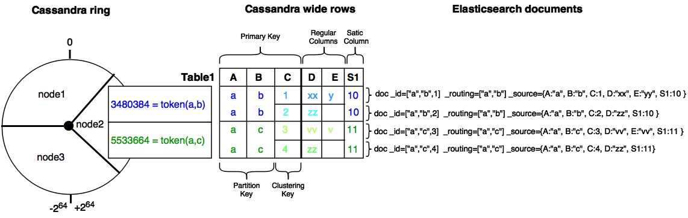

Mapping
=======

Basically, an Elasticsearch index is mapped to a cassandra keyspace, and a document type to a cassandra table.

Type mapping
------------

Here is the mapping from Elasticsearch field basic types to CQL3 types :

.. cssclass:: table-bordered

+----------------------+--------------------------+--------------------------------+
| Elasticearch Types   | CQL Types                | Comment                        |
+======================+==========================+================================+
| string               | text                     |                                |
+----------------------+--------------------------+--------------------------------+
| integer, short, byte | timestamp                |                                |
+----------------------+--------------------------+--------------------------------+
| long                 | bigint                   |                                |
+----------------------+--------------------------+--------------------------------+
| double               | double                   |                                |
+----------------------+--------------------------+--------------------------------+
| float                | float                    |                                |
+----------------------+--------------------------+--------------------------------+
| boolean              | boolean                  |                                |
+----------------------+--------------------------+--------------------------------+
| binary               | blob                     |                                |
+----------------------+--------------------------+--------------------------------+
| ip                   | inet                     | Internet address               |
+----------------------+--------------------------+--------------------------------+
| string               | uuid, timeuuid           | Specific mapping (1)           |
+----------------------+--------------------------+--------------------------------+
| geo_point            | UDT geo_point or text    | Built-In User Defined Type (3) |
+----------------------+--------------------------+--------------------------------+
| geo_shape            | text                     | Require _source enable (2)     |
+----------------------+--------------------------+--------------------------------+
| object, nested       | Custom User Defined Type |                                |
+----------------------+--------------------------+--------------------------------+

(1) Existing Cassandra uuid and timeuuid columns are mapped to Elasticsearch string, but such columns cannot be created through the elasticsearch mapping.
(2) Existing Cassandra text columns containing a geohash string can be mapped to an Elasticsearch geo_point.
(3) Geo shapes require _source to be enabled to store the original JSON document (default is disabled).

These parameters control the cassandra mapping.

.. cssclass:: table-bordered

+---------------------------+-------------------------------+------------------------------------------------------------------------------------------------------------------------------------------------------------------------------------------------------------------------+
| Parameter                 | Values                        | Description                                                                                                                                                                                                            |
+===========================+===============================+========================================================================================================================================================================================================================+
| ``cql_collection``        | **list**, set or singleton    | Control how the field of type X is mapped to a column list<X>, set<X> or X. Default is **list** because Elasticsearch fields are multivalued.                                                                          |
+---------------------------+-------------------------------+------------------------------------------------------------------------------------------------------------------------------------------------------------------------------------------------------------------------+
| ``cql_struct``            | **udt** or map                | Control how an object or nested field is mapped to a User Defined Type or to a cassandra map<text,?>. Default is **udt**.                                                                                              |
+---------------------------+-------------------------------+------------------------------------------------------------------------------------------------------------------------------------------------------------------------------------------------------------------------+
| ``cql_mandatory``         | **true** or false             | Elasticsearch index full document. For partial CQL updates, this control which fields should be read to index a full document from a row. Default is **true** meaning that updates involve reading all missing fields. |
+---------------------------+-------------------------------+------------------------------------------------------------------------------------------------------------------------------------------------------------------------------------------------------------------------+
| ``cql_primary_key_order`` | **integer**                   | Field position in the cassandra the primary key of the underlying cassandra table. Default is **-1** meaning that the field is not part of the cassandra primary key.                                                  |
+---------------------------+-------------------------------+------------------------------------------------------------------------------------------------------------------------------------------------------------------------------------------------------------------------+
| ``cql_partition_key``     | true or **false**             | When the cql_primary_key_order >= 0, specify if the field is part of the cassandra partition key. Default is **false** meaning that the field is not part of the cassandra partition key.                              |
+---------------------------+-------------------------------+------------------------------------------------------------------------------------------------------------------------------------------------------------------------------------------------------------------------+
| ``cql_udt_name``          | **<table_name>_<field_name>** | Specify the Cassandra User Defined Type name to use to store an object. By default, this is automatically build (dots in *field_names* are replaced by underscores)                                                    |
+---------------------------+-------------------------------+------------------------------------------------------------------------------------------------------------------------------------------------------------------------------------------------------------------------+

For more information about cassandra collection types and compound primary key, see `CQL Collections <https://docs.datastax.com/en/cql/3.1/cql/cql_using/use_collections_c.html>`_ and `Compound keys <https://docs.datastax.com/en/cql/3.1/cql/ddl/ddl_compound_keys_c.html>`_.

Bidirectionnal mapping
----------------------

Elassandra supports the `Elasticsearch Indice API <https://www.elastic.co/guide/en/elasticsearch/reference/current/indices.html>`_ and automatically creates the underlying cassandra keyspaces and tables.
For each Elasticsearch document type, a cassandra table is created to reflect the Elasticsearch mapping. However, deleting an index does not remove the underlying keyspace, it just removes cassandra secondary indices associated to mapped columns.

Additionally, with the new put mapping parameter ``discover``, Elassandra create or update the Elasticsearch mapping for an existing cassandra table.
Columns matching the provided regular expression are mapped as Elasticsearch fields. The following command creates the elasticsearch mapping for all columns starting by 'a' of the cassandra table *my_keyspace.my_table*.and set a specific analyzer for column *name*.

.. code::

   curl -XPUT "http://localhost:9200/my_keyspace/_mapping/my_table" -d '{
       "my_table" : {
           "discover" : "a.*",
           "properties" : {
               "name" : {
                   "type" : "string",
                   "index" : "analyzed"
               }
           }
       }
   }'

By default, all text columns are mapped with ``"index":"not_analyzed"``.

.. TIP::
   When creating the first Elasticsearch index for a given cassandra table, elassandra creates a custom CQL secondary index asynchonously for each mapped field when all shards are started.
   Cassandra build index on all nodes for all existing data. Subsequent CQL inserts or updates are automatically indexed in Elasticsearch.
   
   If you then add a second or more Elasticsearch indices to an existing indexed table, existing data are not automatically re-indexed because cassandra has already indexed existing data.
   Instead of re-insert your data in the cassandra table, you may use the following command to force a cassandra index rebuild. It will re-index your cassandra table to all associated elasticsearch indices :

   .. code::

      nodetool rebuild_index --threads <N> <keyspace_name> <table_name> elastic_<table_name>_idx

   * *column_name* is any indexed columns (or elasticsearch top-level document field).
   * *rebuild_index* reindexes SSTables from disk, but not from MEMtables. In order to index the very last inserted document, run a **nodetool flush <kespace_name>** before rebuilding your elasticsearch indices.
   * When deleting an elasticsearch index, elasticsearch index files are removed form the data/elasticsearch.data directory, but cassandra secondary indices remains in the CQL schema until the last associated elasticsearch index is removed. Cassandra is acting as a primary data storage, so keyspace and tables and data are never removed when deleting an elasticsearch index.

Meta-Fields
-----------

`Elasticsearch meta-fields <https://www.elastic.co/guide/en/elasticsearch/reference/current/mapping-fields.html>`_ meaning is slightly different in Elassandra :

* ``_index`` is the index name mapped to the underlying cassandra keyspace name (dash [-] and dot[.] are automatically replaced by underscore [_]).
* ``_type`` is the document type name mapped to the underlying cassandra table name (dash [-] and dot[.] are automatically replaced by underscore [_]).
* ``_id`` is the document ID is a string representation of the primary key of the underlying cassandra table. Single field primary key is converted to a string, compound primary key is converted to a JSON array.
* ``_source`` is the indexed JSON document. By default, *_source* is disabled in ELassandra, meaning that *_source* is rebuild from the underlying cassandra columns. If *_source* is enabled (see `Mapping _source field <https://www.elastic.co/guide/en/elasticsearch/reference/current/mapping-source-field.html>`_) ELassandra stores documents indexed by with the Elasticsearch API in a dedicated Cassandra text column named *_source*. This allows to retreive the orginal JSON document for `GeoShape Query<https://www.elastic.co/guide/en/elasticsearch/reference/current/query-dsl-geo-shape-query.html>`_.
* ``_routing`` is valued with a string representation of the partition key of the underlying cassandra table. Single partition key is converted to a string, compound partition key is converted to a JSON array. Specifying ``_routing`` on get, index or delete operations is useless, since the partition key is included in ``_id``. On search operations, Elassandra compute the cassandra token associated to ``_routing`` for the search type, and reduce the search only to a cassandra node hosting this token. (WARNING: Without any search types, Elassandra cannot compute the cassandra token and returns an error **all shards failed**).
* ``_ttl``  and ``_timestamp`` are mapped to the cassandra `TTL <https://docs.datastax.com/en/cql/3.1/cql/cql_using/use_ttl_t.html>`_ and `WRITIME <https://docs.datastax.com/en/cql/3.1/cql/cql_using/use_writetime.html>`_. The returned ``_ttl``  and ``_timestamp`` for a document will be the one of a regular cassandra columns if there is one in the underlying table. Moreover, when indexing a document throught the Elasticearch API, all cassandra cells carry the same WRITETIME and TTL, but this could be different when upserting some cells using CQL.
* ``_parent`` is string representation of the parent document primary key. If the parent document primary key is composite, this is string representation of columns defined by ``cql_parent_pk`` in the mapping. See `Parent-Child Relationship`_.
* ``_token`` is a meta-field introduced by Elassandra, valued with **token(<partition_key>)**.
* ``_node`` is a meta-field introduced by Elassandra, valued with the cassandra host id, allowing to check the datacenter consistency.

Mapping change with zero downtime
---------------------------------

You can map several Elasticsearch indices with different mapping to the same cassandra keyspace.
By default, an index is mapped to a keyspace with the same name, but you can specify a target ``keyspace`` in your index settings.

For example, you can create a new index **twitter2** mapped to the cassandra keyspace **twitter** and set a mapping for type **tweet** associated to the existing cassandra table **twitter.tweet**.

.. image:: images/elassandra-multi-index.jpg

|

.. code::

   curl -XPUT "http://localhost:9200/twitter2/" -d '{
      "settings" : { "keyspace" : "twitter" } },
      "mappings" : {
         "tweet" : {
               "properties" : {
                 "message" : { "type" : "string", "index" : "not_analyzed" },
                 "post_date" : { "type" : "date", "format": "yyyy-MM-dd" },
                 "user" : { "type" : "string","index" : "not_analyzed" },
                 "size" : { "type" : "long" }
               }
         }
      }
   }

You can set a specific mapping for **twitter2** and re-index existing data on each cassandra node with the following command (indices are named **elastic_<tablename>**).

.. code::

   nodetool rebuild_index [--threads <N>] twitter tweet elastic_tweet_idx

By default, **rebuild_index** use only one thread, but Elassandra supports multi-threaded index rebuild with the new parameter **--threads**.
Index name is <elastic>_<table_name>_<column_name>_idx where *column_name* is any indexed column name.
Once your **twitter2** index is ready, set an alias **twitter** for **twitter2** to switch from the old mapping to the new one, and delete the old **twitter** index.

.. code::

   curl -XPOST "http://localhost:9200/_aliases" -d '{ "actions" : [ { "add" : { "index" : "twitter2", "alias" : "twitter" } } ] }'
   curl -XDELETE "http://localhost:9200/twitter"

Partitioned Index
-----------------

`Elasticsearch TTL <https://www.elastic.co/guide/en/elasticsearch/reference/current/mapping-ttl-field.html>`_ support is deprecated since Elasticsearch 2.0 and the
Elasticsearch TTLService is disabled in Elassandra. Rather than periodically looking for expired documents, Elassandra supports partitioned index allowing to manage per time-frame indices.
Thus, old data can be removed by simply deleting old indices.

Partitioned index also allows to index more than 2^31 documents on a node (2^31 is the lucene max documents per index).

An index partition function acts as a selector when many indices are associated to a cassandra table. A partition function is defined by 3 or more fields separated by a space character :

* Function name.
* Index name pattern.
* 1 to N document field names.

The target index name is the result your partition function,

A partition function must implements the java interface **org.elassandra.index.PartitionFunction**. Two implementation classes are provided :

* **StringFormatPartitionFunction** (the default) based on the JDK function `String.format(Locale locale, <parttern>,<arg1>,...) <https://docs.oracle.com/javase/8/docs/api/java/lang/String.html>`_.
* **MessageFormatPartitionFunction** based on the JDK function `MessageFormat.format(<parttern>,<arg1>,...) <https://docs.oracle.com/javase/8/docs/api/java/text/MessageFormat.html#format-java.lang.String-java.lang.Object...->`_.

Index partition function are stored in a map, so a given index function is executed exactly once for all mapped index.
For example, the **toYearIndex** function generates the target index **logs_<year>** depending on the value of the **date_field** for each document (or row).

|

.. image:: images/elassandra-partition-function.jpg

|

You can define each per-year index as follow, with the same ``index.partition_function`` for all **logs_<year>**.
All those indices will be mapped to the keyspace **logs**, and all columns of the table **mylog** automatically mapped to the document type **mylog**.

.. code::

   curl -XPUT "http://localhost:9200/logs_2016" -d '{
     "settings": {
         "keyspace":"logs",
         "index.partition_function":"toYearIndex logs_{0,date,yyyy} date_field",
         "index.partition_function_class":"MessageFormatPartitionFunction"
     },
     "mappings": {
         "mylog" : { "discover" : ".*" }
     }
   }'

.. TIP::
   When creating the first Elasticsearch index for a Cassandra table, Elassandra may create some Cassandra secondary indices. Only the first created secondary index trigger a compaction to index the existing data. So, if you create a partitioned index on a table having some data, the index rebuild may start before all partition are created, and some rows could be ignored if matching a not yet created partitioned index. To avoid this situation, create partitioned indices before injecting data or rebuild the secondary index entirely. 

.. TIP::
   Partition function is executed for each indexed document, so if write throughput is a concern, you should choose an efficient implementation class.
    
To remove an old index.

.. code::

   curl -XDELETE "http://localhost:9200/logs_2013"

`Cassandra TTL <https://docs.datastax.com/en/cql/3.1/cql/cql_using/use_expire_c.html>`_ can be used in conjunction with partitioned index to automatically removed rows during the normal cassandra compaction and repair processes when ``index_on_compaction`` is *true*, but this introduce a lucene merge overhead because document are re-indexed when compacting. You can also use the `DateTieredCompactionStrategy <http://www.datastax.com/dev/blog/dtcs-notes-from-the-field>`_ to the `TimeWindowTieredCompactionStrategy <http://www.datastax.com/dev/blog/twtcs-notes-from-the-field>`_ to improve performance of time series-like workloads.

Object and Nested mapping
-------------------------

By default, Elasticsearch `Object or nested types <https://www.elastic.co/guide/en/elasticsearch/reference/current/mapping-object-type.html>`_ are mapped to dynamically created Cassandra `User Defined Types <https://docs.datastax.com/en/cql/3.1/cql/cql_using/cqlUseUDT.html>`_.

.. code::

   curl -XPUT 'http://localhost:9200/twitter/tweet/1' -d '{
        "user" : {
            "name" : {
                "first_name" : "Vincent",
                "last_name" : "Royer"
            },
            "uid" : "12345"
        },
        "message" : "This is a tweet!"
   }'

   curl -XGET 'http://localhost:9200/twitter/tweet/1/_source'
   {"message":"This is a tweet!","user":{"uid":["12345"],"name":[{"first_name":["Vincent"],"last_name":["Royer"]}]}}

The resulting cassandra user defined types and table.

.. code::

   cqlsh>describe keyspace twitter;
   CREATE TYPE twitter.tweet_user (
       name frozen<list<frozen<tweet_user_name>>>,
       uid frozen<list<text>>
   );

   CREATE TYPE twitter.tweet_user_name (
       last_name frozen<list<text>>,
       first_name frozen<list<text>>
   );

   CREATE TABLE twitter.tweet (
       "_id" text PRIMARY KEY,
       message list<text>,
       person list<frozen<tweet_person>>
   )

   cqlsh> select * from twitter.tweet;
   _id  | message              | user
   -----+----------------------+-----------------------------------------------------------------------------
   1 | ['This is a tweet!'] | [{name: [{last_name: ['Royer'], first_name: ['Vincent']}], uid: ['12345']}]

Dynamic mapping of Cassandra Map
--------------------------------

Nested document can be mapped to `User Defined Type <https://docs.datastax.com/en/cql/3.1/cql/cql_using/cqlUseUDT.html>`_ or to CQL `map <http://docs.datastax.com/en/cql/3.1/cql/cql_using/use_map_t.html#toc_pane>`_.
In the following example, the cassandra map is automatically mapped with ``cql_mandatory:true``, so a partial CQL update cause a read of the whole map to re-index a document in the elasticsearch index.

.. code::

   cqlsh>CREATE KEYSPACE IF NOT EXISTS twitter WITH replication={ 'class':'NetworkTopologyStrategy', 'dc1':'1' };
   cqlsh>CREATE TABLE twitter.user (
      name text,
      attrs map<text,text>,
      PRIMARY KEY (name)
   );
   cqlsh>INSERT INTO twitter.user (name,attrs) VALUES ('bob',{'email':'bob@gmail.com','firstname':'bob'});

Create the type mapping from the cassandra table and search for the *bob* entry.

.. code::

   curl -XPUT "http://localhost:9200/twitter/_mapping/user" -d '{ "user" : { "discover" : ".*" }}'
   {"acknowledged":true}

   curl -XGET 'http://localhost:9200/twitter/_mapping/user?pretty=true'
   {
     "twitter" : {
       "mappings" : {
         "user" : {
           "properties" : {
             "attrs" : {
               "type" : "nested",
               "cql_struct" : "map",
               "cql_collection" : "singleton",
               "properties" : {
                 "email" : {
                   "type" : "string"
                 },
                 "firstname" : {
                   "type" : "string"
                 }
               }
             },
             "name" : {
               "type" : "string",
               "cql_collection" : "singleton",
               "cql_partition_key" : true,
               "cql_primary_key_order" : 0
             }
           }
         }
       }
     }
   }

   curl -XGET "http://localhost:9200/twitter/user/bob?pretty=true"
   {
     "_index" : "twitter",
     "_type" : "user",
     "_id" : "bob",
     "_version" : 0,
     "found" : true,
     "_source":{"name":"bob","attrs":{"email":"bob@gmail.com","firstname":"bob"}}
   }

Now insert a new entry in the attrs map column and search for a nested field `attrs.city:paris`.

.. code::

   cqlsh>UPDATE twitter.user SET attrs = attrs + { 'city':'paris' } WHERE name = 'bob';

   curl -XGET "http://localhost:9200/twitter/_search?pretty=true" -d '{
   "query":{
       "nested":{
               "path":"attrs",
               "query":{ "match": {"attrs.city":"paris" } }
                }
           }
   }'
   {
     "took" : 3,
     "timed_out" : false,
     "_shards" : {
       "total" : 1,
       "successful" : 1,
       "failed" : 0
     },
     "hits" : {
       "total" : 1,
       "max_score" : 2.3862944,
       "hits" : [ {
         "_index" : "twitter",
         "_type" : "user",
         "_id" : "bob",
         "_score" : 2.3862944,
         "_source":{"attrs":{"city":"paris","email":"bob@gmail.com","firstname":"bob"},"name":"bob"}
       } ]
     }
   }

Dynamic Template with Dynamic Mapping
.....................................

Dynamic templates can be used when creating a dynamic field from a Cassandra map.

.. code::

   "mappings" : {
         "event_test" : {
            "dynamic_templates": [
                   { "strings_template": {
                         "match": "strings.*", 
                         "mapping": {
                             "type": "string",
                             "index": "not_analyzed"
                         }
                   }}
               ],
           "properties" : {
             "id" : {
               "type" : "string",
               "index" : "not_analyzed",
               "cql_collection" : "singleton",
               "cql_partition_key" : true,
               "cql_primary_key_order" : 0
             },
             "strings" : {
               "type" : "object",
               "cql_struct" : "map",
               "cql_collection" : "singleton"
             }
           }
         }
   }
   
Then, a new entry *key1* in the underlying cassandra map will have the following mapping:

.. code::

   "mappings" : {
          "event_test" : {
            "dynamic_templates" : [ {
              "strings_template" : {
                "mapping" : {
                  "index" : "not_analyzed",
                  "type" : "string",
                  "doc_values" : true
                },
                "match" : "strings.*"
              }
            } ],
            "properties" : {
              "strings" : {
                "cql_struct" : "map",
                "cql_collection" : "singleton",
                "type" : "nested",
                "properties" : {
                  "key1" : {
                    "index" : "not_analyzed",
                    "type" : "string"
                  }
              },
              "id" : {
                "index" : "not_analyzed",
                "type" : "string",
                "cql_partition_key" : true,
                "cql_primary_key_order" : 0,
                "cql_collection" : "singleton"
              }
            }
          }
        }    

Note that because doc_values is true by default for a not analyzed field, it does not appear in the mapping.

Parent-Child Relationship
-------------------------

Elassandra supports `parent-child relationship <https://www.elastic.co/guide/en/elasticsearch/guide/current/parent-child.html>`_ when parent and child document
are located on the same cassandra node. This condition is met :

* when running a single node cluster,
* when the keyspace replication factor equals the number of nodes or
* when the parent and child documents share the same cassandra partition key, as shown in the following example.

Create an index company (a cassandra keyspace), a cassandra table, insert 2 rows and map this table as document type employee.

.. code::

   cqlsh <<EOF
   CREATE KEYSPACE IF NOT EXISTS company WITH replication={ 'class':'NetworkTopologyStrategy', 'dc1':'1' };
   CREATE TABLE company.employee (
   "_parent" text,
   "_id" text,
   name text,
   dob timestamp,
   hobby text,
   primary key (("_parent"),"_id")
   );
   INSERT INTO company.employee ("_parent","_id",name,dob,hobby) VALUES ('london','1','Alice Smith','1970-10-24','hiking');
   INSERT INTO company.employee ("_parent","_id",name,dob,hobby) VALUES ('london','2','Alice Smith','1990-10-24','hiking');
   EOF

   curl -XPUT "http://$NODE:9200/company2" -d '{
      "mappings" : {
       "employee" : {
               "discover" : ".*",
               "_parent"  : { "type": "branch", "cql_parent_pk":"branch" }
           }
       }
   }'
   curl -XPOST "http://127.0.0.1:9200/company/branch/_bulk" -d '
   { "index": { "_id": "london" }}
   { "district": "London Westminster", "city": "London", "country": "UK" }
   { "index": { "_id": "liverpool" }}
   { "district": "Liverpool Central", "city": "Liverpool", "country": "UK" }
   { "index": { "_id": "paris" }}
   { "district": "Champs Élysées", "city": "Paris", "country": "France" }
   '

Search for documents having children document of type *employee* with *dob* date greater than 1980.

.. code::

   curl -XGET "http://$NODE:9200/company2/branch/_search?pretty=true" -d '{
     "query": {
       "has_child": {
         "type": "employee",
         "query": {
           "range": {
             "dob": {
               "gte": "1980-01-01"
             }
           }
         }
       }
     }
   }'

Search for employee documents having a parent document where *country* match UK.

.. code::

   curl -XGET "http://$NODE:9200/company2/employee/_search?pretty=true" -d '{
     "query": {
       "has_parent": {
         "parent_type": "branch",
         "query": {
           "match": { "country": "UK"
           }
         }
       }
     }
   }'

Indexing Cassandra static columns
---------------------------------

When a Cassandra table have one or more clustering columns, a `static columns <http://docs.datastax.com/en/cql/3.1/cql/cql_reference/refStaticCol.html>`_ is shared by all the rows with the same partition key.

A slight modification of cassandra code provides support of secondary index on static columns, allowing to search on static columns values (CQL search on static columns remains unsupported).
Each time a static columns is modified, a document containing the partition key and only static columns is indexed in Elasticserach.
By default, static columns are not indexed with every `wide rows <http://www.planetcassandra.org/blog/wide-rows-in-cassandra-cql/>`_ because any update on a static column would require reindexation of all wide rows.
However, you can request for fields backed by a static columns on any get/search request.

The following example demonstrates how to use static columns to store meta information of a timeserie.

.. code::

   curl -XPUT "http://localhost:9200/test" -d '{
      "mappings" : {
          "timeseries" : {
            "properties" : {
              "t" : {
                "type" : "date",
                "format" : "strict_date_optional_time||epoch_millis",
                "cql_primary_key_order" : 1,
                "cql_collection" : "singleton"
              },
              "meta" : {
                "type" : "nested",
                "cql_struct" : "map",
                "cql_static_column" : true,
                "cql_collection" : "singleton",
                "include_in_parent" : true,
                "properties" : {
                  "region" : {
                    "type" : "string"
                  }
                }
              },
              "v" : {
                "type" : "double",
                "cql_collection" : "singleton"
              },
              "m" : {
                "type" : "string",
                "cql_partition_key" : true,
                "cql_primary_key_order" : 0,
                "cql_collection" : "singleton"
              }
            }
          }
     }
   }'

   cqlsh <<EOF
   INSERT INTO test.timeseries (m, t, v) VALUES ('server1-cpu', '2016-04-10 13:30', 10);
   INSERT INTO test.timeseries (m, t, v) VALUES ('server1-cpu', '2016-04-10 13:31', 20);
   INSERT INTO test.timeseries (m, t, v) VALUES ('server1-cpu', '2016-04-10 13:32', 15);
   INSERT INTO test.timeseries (m, meta) VALUES ('server1-cpu', { 'region':'west' } );
   SELECT * FROM test.timeseries;
   EOF

    m           | t                           | meta               | v
   -------------+-----------------------------+--------------------+----
    server1-cpu | 2016-04-10 11:30:00.000000z | {'region': 'west'} | 10
    server1-cpu | 2016-04-10 11:31:00.000000z | {'region': 'west'} | 20
    server1-cpu | 2016-04-10 11:32:00.000000z | {'region': 'west'} | 15

Search for wide rows only where v=10 and fetch the meta.region field.

.. code::

   curl -XGET "http://localhost:9200/test/timeseries/_search?pretty=true&q=v:10&fields=m,t,v,meta.region,_source"

   "hits" : [ {
         "_index" : "test",
         "_type" : "timeseries",
         "_id" : "[\"server1-cpu\",1460287800000]",
         "_score" : 1.9162908,
         "_routing" : "server1-cpu",
         "_source" : {
               "t" : "2016-04-10T11:30:00.000Z",
               "v" : 10.0,
               "meta" : { "region" : "west" },
               "m" : "server1-cpu"
         },
         "fields" : {
           "meta.region" : [ "west" ],
           "t" : [ "2016-04-10T11:30:00.000Z" ],
           "m" : [ "server1-cpu" ],
           "v" : [ 10.0 ]
         }
       } ]

Search for rows where meta.region=west, returns only the partition key and static columns.

.. code::

   curl -XGET "http://localhost:9200/test/timeseries/_search?pretty=true&q=meta.region:west&fields=m,t,v,meta.region"
   "hits" : {
       "total" : 1,
       "max_score" : 1.5108256,
       "hits" : [ {
         "_index" : "test",
         "_type" : "timeseries",
         "_id" : "server1-cpu",
         "_score" : 1.5108256,
         "_routing" : "server1-cpu",
         "fields" : {
           "m" : [ "server1-cpu" ],
           "meta.region" : [ "west" ]
         }
       } ]

If needed, you can change the default behavior for a specific cassandra table (or elasticsearch document type), by using the following custom metadata :

* ``index_static_columns`` controls whether or not static columns are included in indexed documents (default is *false*).
* ``index_static_only`` if *true*, it ony indexes documents with partition key as ``_id`` and static columns as fields.

In our example with the following mapping, static columns are indexed in every documents, allowing to search on.

.. code::

   curl -XPUT http://localhost:9200/test/_mapping/timeseries -d '{ "timeseries": { "discover" : ".*", "_meta": { "index_static_columns":true } }}'
   
Elassandra as a JSON-REST Gateway
---------------------------------

When dynamic mapping is disabled and a mapping type has no indexed field, elassandra nodes can act as a JSON-REST gateway for cassandra to get, set or delete a cassandra row without any indexing overhead.
In this case, the mapping may be use to cast types or format date fields, as shown below.

.. code::

   CREATE TABLE twitter.tweet (
       "_id" text PRIMARY KEY,
       message list<text>,
       post_date list<timestamp>,
       size list<bigint>,
       user list<text>
   )
   
   curl -XPUT "http://$NODE:9200/twitter/" -d'{ 
      "settings":{ "index.mapper.dynamic":false }, 
      "mappings":{
         "tweet":{ 
            "properties":{ 
               "size":     { "type":"long", "index":"no" },
               "post_date":{ "type":"date", "index":"no", "format" : "strict_date_optional_time||epoch_millis" }
             }
         }
      }
   }'

As the result, you can index, get or delete a cassandra row, including any column of your cassandra table.

.. code::

   curl -XPUT "http://localhost:9200/twitter/tweet/1?consistency=one" -d '{
        "user" : "vince",
        "post_date" : "2009-11-15T14:12:12",
        "message" : "look at Elassandra !!",
        "size": 50
   }'
   {"_index":"twitter","_type":"tweet","_id":"1","_version":1,"_shards":{"total":1,"successful":1,"failed":0},"created":true}
   
   $ curl -XGET "http://localhost:9200/twitter/tweet/1?pretty=true&fields=message,user,size,post_date'
   {
     "_index" : "twitter",
     "_type" : "tweet",
     "_id" : "1",
     "_version" : 1,
     "found" : true,
     "fields" : {
       "size" : [ 50 ],
       "post_date" : [ "2009-11-15T14:12:12.000Z" ],
       "message" : [ "look at Elassandra !!" ],
       "user" : [ "vince" ]
     }
   }

   $ curl -XDELETE "http://localhost:9200/twitter/tweet/1?pretty=true'
   {
     "found" : true,
     "_index" : "twitter",
     "_type" : "tweet",
     "_id" : "1",
     "_version" : 0,
     "_shards" : {
       "total" : 1,
       "successful" : 1,
       "failed" : 0
     }
   }

Check Cassandra consistency with elasticsearch
----------------------------------------------

When the ``index.include_node = true``  (default is false), the ``_node`` metafield containing the Cassandra host id is included in every indexed document.
This allows to to distinguish multiple copies of a document when the datacenter replication factor is greater than one. Then a token range aggregation allows to count the number of documents for each token range and for each Cassandra node.

In the following example, we have 1000 accounts documents in a keyspace with RF=2 in a two nodes datacenter, and each token ranges have the same number of document for the two nodes.

.. code::

   curl -XGET "http://$NODE:9200/accounts/_search?pretty=true&size=0" -d'{
           "aggs" : {
               "tokens" : {
                   "token_range" : { 
                      "field" : "_token" 
                    },
                   "aggs": { 
                      "nodes" : { 
                         "terms" : { "field" : "_node" } 
                      } 
                   }
               }
           }
       }'
   {
     "took" : 23,
     "timed_out" : false,
     "_shards" : {
       "total" : 2,
       "successful" : 2,
       "failed" : 0
     },
     "hits" : {
       "total" : 2000,
       "max_score" : 0.0,
       "hits" : [ ]
     },
     "aggregations" : {
       "tokens" : {
         "buckets" : [ {
           "key" : "(-9223372036854775807,-4215073831085397715]",
           "from" : -9223372036854775807,
           "from_as_string" : "-9223372036854775807",
           "to" : -4215073831085397715,
           "to_as_string" : "-4215073831085397715",
           "doc_count" : 562,
           "nodes" : {
             "doc_count_error_upper_bound" : 0,
             "sum_other_doc_count" : 0,
             "buckets" : [ {
               "key" : "528b78d3-fae9-49ae-969a-96668566f1c3",
               "doc_count" : 281
             }, {
               "key" : "7f0b782e-5b75-409b-85e9-f5f96a75a7dc",
               "doc_count" : 281
             } ]
           }
         }, {
           "key" : "(-4215073831085397714,7919694572960951318]",
           "from" : -4215073831085397714,
           "from_as_string" : "-4215073831085397714",
           "to" : 7919694572960951318,
           "to_as_string" : "7919694572960951318",
           "doc_count" : 1268,
           "nodes" : {
             "doc_count_error_upper_bound" : 0,
             "sum_other_doc_count" : 0,
             "buckets" : [ {
               "key" : "528b78d3-fae9-49ae-969a-96668566f1c3",
               "doc_count" : 634
             }, {
               "key" : "7f0b782e-5b75-409b-85e9-f5f96a75a7dc",
               "doc_count" : 634
             } ]
           }
         }, {
           "key" : "(7919694572960951319,9223372036854775807]",
           "from" : 7919694572960951319,
           "from_as_string" : "7919694572960951319",
           "to" : 9223372036854775807,
           "to_as_string" : "9223372036854775807",
           "doc_count" : 170,
           "nodes" : {
             "doc_count_error_upper_bound" : 0,
             "sum_other_doc_count" : 0,
             "buckets" : [ {
               "key" : "528b78d3-fae9-49ae-969a-96668566f1c3",
               "doc_count" : 85
             }, {
               "key" : "7f0b782e-5b75-409b-85e9-f5f96a75a7dc",
               "doc_count" : 85
             } ]
           }
         } ]
       }
     }
   }
   
Of course, according to your use case, you should add a filter to your query to ignore write operations occurring during the check.

