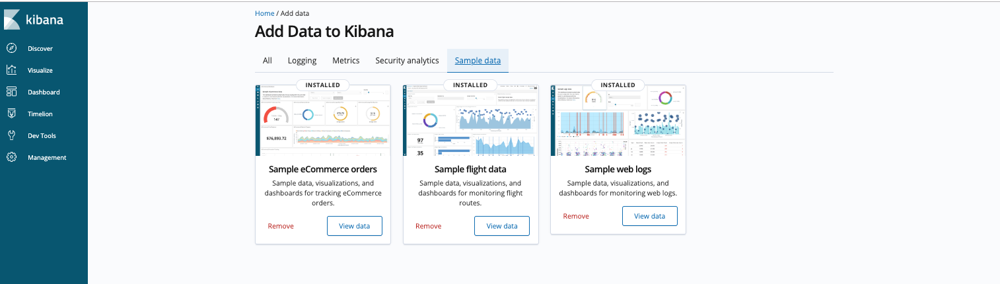
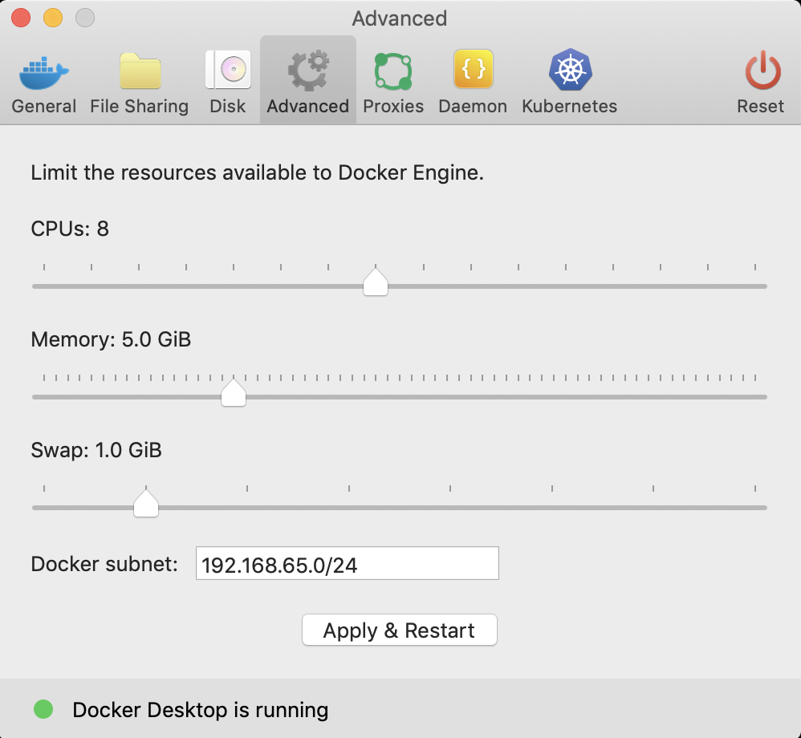

Quick Start
===========

Start your cluster
------------------

Start a docker-based Elassandra cluster using docker-compose file **ci/docker-compose.yml**:

.. code::

    version: '2.4'
    services:
      seed_node:
        image: "docker.io/strapdata/elassandra:6.8.4.3"
        environment:
          - "JVM_OPTS=-Dcassandra.custom_query_handler_class=org.elassandra.index.ElasticQueryHandler"
          - "MAX_HEAP_SIZE=1200m"
          - "HEAP_NEWSIZE=300m"
          - "CASSANDRA_CGROUP_MEMORY_LIMIT=true"
          - "DEBUG=true"
        cap_add:
          - IPC_LOCK
        ulimits:
          memlock: -1
        mem_limit: 2000m
        ports:
          - "9042:9042"
          - "9200:9200"
      node:
        image: "docker.io/strapdata/elassandra:6.8.4.3"
        environment:
          - "JVM_OPTS=-Dcassandra.custom_query_handler_class=org.elassandra.index.ElasticQueryHandler"
          - "MAX_HEAP_SIZE=1200m"
          - "HEAP_NEWSIZE=300m"
          - "CASSANDRA_CGROUP_MEMORY_LIMIT=true"
          - "CASSANDRA_SEEDS=seed_node"
          - "DEBUG=true"
        links:
          - seed_node
        cap_add:
          - IPC_LOCK
        ulimits:
          memlock: -1
        mem_limit: 2000m

      kibana:
        image: docker.elastic.co/kibana/kibana-oss:6.8.4
        environment:
          - "ELASTICSEARCH_URL=http://seed_node:9200"
        ports:
          - "5601:5601"
        mem_limit: 500m

Start containers and scale up the elassandra cluster :

.. code::

    docker-compose --project-name test -f docker-compose.yml up -d --scale node=0
    docker-compose --project-name test -f docker-compose.yml up -d --scale node=1

Check the cassandra nodes status:

.. code::

   	docker exec -i test_seed_node_1 nodetool status
   	Datacenter: DC1
	===============
	Status=Up/Down
	|/ State=Normal/Leaving/Joining/Moving
	--  Address     Load       Tokens       Owns (effective)  Host ID                               Rack
	UN  172.19.0.3  8.02 MiB   8            61.1%             14ac0af0-e51a-4f98-b57d-7b012b584d84  r1
	UN  172.19.0.4  3.21 MiB   8            38.9%             fec10e1f-4191-41d5-9a58-7abcccc5972f  r1

Import sample data
------------------

After about 35 secondes to start Elassandra on node0, you should have access to kibana at http://localhost:5601, and you can insert sample data and browse sample dashboards.

View the kibana sample data in Cassandra:

.. code::

    docker exec -it test_seed_node_1 cqlsh

    Connected to Test Cluster at 127.0.0.1:9042.
    [cqlsh 5.0.1 | Cassandra 3.11.5 | CQL spec 3.4.4 | Native protocol v4]
    Use HELP for help.
    cqlsh> select * from kibana_sample_data_logs."_doc" limit 3;

     _id                  | agent                                                                                                     | bytes   | clientip            | extension | geo                                                                                               | host                            | index                       | ip                  | machine                                | memory      | message                                                                                                                                                                                                                                         | phpmemory | referer                                                             | request                                                      | response | tags                    | timestamp                           | url                                                                                             | utc_time
    ----------------------+-----------------------------------------------------------------------------------------------------------+---------+---------------------+-----------+---------------------------------------------------------------------------------------------------+---------------------------------+-----------------------------+---------------------+----------------------------------------+-------------+-------------------------------------------------------------------------------------------------------------------------------------------------------------------------------------------------------------------------------------------------+-----------+---------------------------------------------------------------------+--------------------------------------------------------------+----------+-------------------------+-------------------------------------+-------------------------------------------------------------------------------------------------+-------------------------------------
     _ISA224B3U12qk8z3Q78 | ['Mozilla/5.0 (X11; Linux i686) AppleWebKit/534.24 (KHTML, like Gecko) Chrome/11.0.696.50 Safari/534.24'] |  [6465] | ['236.132.209.242'] |      [''] | [{srcdest: ['CA:MY'], src: ['CA'], coordinates: [{lat: 43.10318, lon: -78.70335}], dest: ['MY']}] | ['elastic-elastic-elastic.org'] | ['kibana_sample_data_logs'] | ['236.132.209.242'] |  [{os: ['win 7'], ram: [18253611008]}] | [2.586e+05] | ['236.132.209.242 - - [2018-08-26T10:51:51.506Z] "GET /people/type:astronauts/name:john-david-f-bartoe/profile HTTP/1.1" 200 6465 "-" "Mozilla/5.0 (X11; Linux i686) AppleWebKit/534.24 (KHTML, like Gecko) Chrome/11.0.696.50 Safari/534.24"'] |  [258600] | ['http://www.elastic-elastic-elastic.com/success/john-o-creighton'] | ['/people/type:astronauts/name:john-david-f-bartoe/profile'] |  ['200'] | ['success', 'security'] | ['2019-12-29 10:51:51.506000+0000'] | ['https://elastic-elastic-elastic.org/people/type:astronauts/name:john-david-f-bartoe/profile'] | ['2018-08-26 10:51:51.506000+0000']
     L4OA224B3U12qk8zxvxM |                                ['Mozilla/5.0 (X11; Linux x86_64; rv:6.0a1) Gecko/20110421 Firefox/6.0a1'] |  [9842] |     ['1.8.196.147'] |      [''] | [{srcdest: ['DE:CN'], src: ['DE'], coordinates: [{lat: 35.10117, lon: -75.96595}], dest: ['CN']}] |              ['www.elastic.co'] | ['kibana_sample_data_logs'] |     ['1.8.196.147'] | [{os: ['win xp'], ram: [12884901888]}] |        null |                                                                                 ['1.8.196.147 - - [2018-08-05T16:38:26.871Z] "GET /enterprise HTTP/1.1" 200 9842 "-" "Mozilla/5.0 (X11; Linux x86_64; rv:6.0a1) Gecko/20110421 Firefox/6.0a1"'] |      null |                    ['http://facebook.com/warning/stephen-robinson'] |                                              ['/enterprise'] |  ['200'] |     ['success', 'info'] | ['2019-12-08 16:38:26.871000+0000'] |                                                 ['https://www.elastic.co/downloads/enterprise'] | ['2018-08-05 16:38:26.871000+0000']
     R4SA224B3U12qk8z4hPC |                                ['Mozilla/5.0 (X11; Linux x86_64; rv:6.0a1) Gecko/20110421 Firefox/6.0a1'] | [19561] |    ['190.43.53.42'] |   ['rpm'] | [{srcdest: ['BD:CN'], src: ['BD'], coordinates: [{lat: 36.28002, lon: -80.78607}], dest: ['CN']}] |        ['artifacts.elastic.co'] | ['kibana_sample_data_logs'] |    ['190.43.53.42'] |   [{os: ['win 8'], ram: [9663676416]}] |        null |                                               ['190.43.53.42 - - [2018-08-30T12:40:40.089Z] "GET /beats/metricbeat/metricbeat-6.3.2-i686.rpm HTTP/1.1" 200 19561 "-" "Mozilla/5.0 (X11; Linux x86_64; rv:6.0a1) Gecko/20110421 Firefox/6.0a1"'] |      null |   ['http://www.elastic-elastic-elastic.com/success/pavel-belyayev'] |              ['/beats/metricbeat/metricbeat-6.3.2-i686.rpm'] |  ['200'] |     ['success', 'info'] | ['2020-01-02 12:40:40.089000+0000'] |           ['https://artifacts.elastic.co/downloads/beats/metricbeat/metricbeat-6.3.2-i686.rpm'] | ['2018-08-30 12:40:40.089000+0000']

    (3 rows)

Create an Elasticsearch index from a Cassandra table
----------------------------------------------------

Use the cassandra CQLSH to create a cassandra Keyspace, a User Defined Type, a Table and add two rows:

.. code::
   
   docker exec -i test_seed_node_1 cqlsh <<EOF
   CREATE KEYSPACE IF NOT EXISTS test WITH replication = {'class': 'NetworkTopologyStrategy', 'DC1': 1};
   CREATE TYPE IF NOT EXISTS test.user_type (first text, last text);
   CREATE TABLE IF NOT EXISTS test.docs (uid int, username frozen<user_type>, login text, PRIMARY KEY (uid));
   INSERT INTO test.docs (uid, username, login) VALUES (1, {first:'vince',last:'royer'}, 'vroyer');
   INSERT INTO test.docs (uid, username, login) VALUES (2, {first:'barthelemy',last:'delemotte'}, 'barth');
   EOF

Create an Elasticsearch index from the Cassandra table schema by discovering the CQL schema:

.. code::
   
   curl -XPUT -H 'Content-Type: application/json' http://localhost:9200/test -d'{"mappings":{"docs":{"discover":".*"}}}'
   {"acknowledged":true,"shards_acknowledged":true,"index":"test"}

This command discovers all column matching the provided regular expression, and creates the Eslasticsearch index.

Create an Elasticsearch index from scratch
------------------------------------------

Elassandra automatically generates the underlying CQL schema when creating an index or updating the mapping with a new field.

.. code::
   
   curl -XPUT -H 'Content-Type: application/json' http://localhost:9200/test2 -d'{
      "mappings":{
         "docs":{
            "properties": {
               "first": {
                  "type":"text"
               },
               "last": {
                  "type":"text",
                  "cql_collection":"singleton"
               }
            }
         }
      }
   }'

Generated CQL schema:

.. code::

   cqlsh> desc KEYSPACE test2;
   
   CREATE KEYSPACE test2 WITH replication = {'class': 'NetworkTopologyStrategy', 'DC1': '1'}  AND durable_writes = true;
   
   CREATE TABLE test2.docs (
       "_id" text PRIMARY KEY,
       first list<text>,
       last text
   ) WITH bloom_filter_fp_chance = 0.01
       AND caching = {'keys': 'ALL', 'rows_per_partition': 'NONE'}
       AND comment = ''
       AND compaction = {'class': 'org.apache.cassandra.db.compaction.SizeTieredCompactionStrategy', 'max_threshold': '32', 'min_threshold': '4'}
       AND compression = {'chunk_length_in_kb': '64', 'class': 'org.apache.cassandra.io.compress.LZ4Compressor'}
       AND crc_check_chance = 1.0
       AND dclocal_read_repair_chance = 0.1
       AND default_time_to_live = 0
       AND gc_grace_seconds = 864000
       AND max_index_interval = 2048
       AND memtable_flush_period_in_ms = 0
       AND min_index_interval = 128
       AND read_repair_chance = 0.0
       AND speculative_retry = '99PERCENTILE';
   CREATE CUSTOM INDEX elastic_docs_idx ON test2.docs () USING 'org.elassandra.index.ExtendedElasticSecondaryIndex';

Search for a document
---------------------

Search for a document through the Elasticsearch API:

.. code::
   
   curl "http://localhost:9200/test/_search?pretty"
   {
     "took" : 10,
     "timed_out" : false,
     "_shards" : {
       "total" : 1,
       "successful" : 1,
       "skipped" : 0,
       "failed" : 0
     },
     "hits" : {
       "total" : 2,
       "max_score" : 1.0,
       "hits" : [
         {
           "_index" : "test",
           "_type" : "docs",
           "_id" : "1",
           "_score" : 1.0,
           "_source" : {
             "uid" : 1,
             "login" : "vroyer",
             "username" : {
               "last" : "royer",
               "first" : "vince"
             }
           }
         },
         {
           "_index" : "test",
           "_type" : "docs",
           "_id" : "2",
           "_score" : 1.0,
           "_source" : {
             "uid" : 2,
             "login" : "barth",
             "username" : {
               "last" : "delemotte",
               "first" : "barthelemy"
             }
           }
         }
       ]
     }
   }

In order to search a document through the CQL driver, add the following two dummy columns in your table schema. Then, 
execute an Elasticsearch nested query. The dummy columns allow you to specify the targeted index
when index name does not match the keyspace name.

.. code::
   
   docker exec -i test_seed_node_1 cqlsh <<EOF
   ALTER TABLE test.docs ADD es_query text;
   ALTER TABLE test.docs ADD es_options text;
   cqlsh> SELECT uid, login, username FROM test.docs WHERE es_query='{ "query":{"nested":{"path":"username","query":{"term":{"username.first":"barthelemy"}}}}}' AND es_options='indices=test' ALLOW FILTERING;
   uid | login | username
   ----+-------+------------------------------------------
     2 | barth | {first: 'barthelemy', last: 'delemotte'}
      
   (1 rows)

Manage Elasticsearch indices
----------------------------

Get the Elasticsearch cluster state:

.. code::

   curl "http://localhost:9200/_cluster/state?pretty"
   {
     "cluster_name" : "Test Cluster",
     "compressed_size_in_bytes" : 579,
     "version" : 8,
     "state_uuid" : "mrE5raXOQO2SVA8AROJqwQ",
     "master_node" : "25457162-c5ef-44fa-a46b-a96434aae319",
     "blocks" : { },
     "nodes" : {
       "25457162-c5ef-44fa-a46b-a96434aae319" : {
         "name" : "172.17.0.2",
         "status" : "ALIVE",
         "ephemeral_id" : "25457162-c5ef-44fa-a46b-a96434aae319",
         "transport_address" : "172.17.0.2:9300",
         "attributes" : {
           "rack" : "r1",
           "dc" : "DC1"
         }
       }
     },
     "metadata" : {
       "version" : 1,
       "cluster_uuid" : "25457162-c5ef-44fa-a46b-a96434aae319",
       "templates" : { },
       "indices" : {
         "test" : {
           "state" : "open",
           "settings" : {
             "index" : {
               "creation_date" : "1553512833429",
               "number_of_shards" : "1",
               "number_of_replicas" : "0",
               "uuid" : "BOolxI89SqmrcbK7KM4sIA",
               "version" : {
                 "created" : "6020399"
               },
               "provided_name" : "test"
             }
           },
           "mappings" : {
             "docs" : {
               "properties" : {
                 "uid" : {
                   "cql_partition_key" : true,
                   "cql_primary_key_order" : 0,
                   "type" : "integer",
                   "cql_collection" : "singleton"
                 },
                 "login" : {
                   "type" : "keyword",
                   "cql_collection" : "singleton"
                 },
                 "username" : {
                   "cql_udt_name" : "user_type",
                   "type" : "nested",
                   "properties" : {
                     "last" : {
                       "type" : "keyword",
                       "cql_collection" : "singleton"
                     },
                     "first" : {
                       "type" : "keyword",
                       "cql_collection" : "singleton"
                     }
                   },
                   "cql_collection" : "singleton"
                 }
               }
             }
           },
           "aliases" : [ ],
           "primary_terms" : {
             "0" : 0
           },
           "in_sync_allocations" : {
             "0" : [ ]
           }
         }
       },
       "index-graveyard" : {
         "tombstones" : [ ]
       }
     },
     "routing_table" : {
       "indices" : {
         "test" : {
           "shards" : {
             "0" : [
               {
                 "state" : "STARTED",
                 "primary" : true,
                 "node" : "25457162-c5ef-44fa-a46b-a96434aae319",
                 "relocating_node" : null,
                 "shard" : 0,
                 "index" : "test",
                 "token_ranges" : [
                   "(-9223372036854775808,9223372036854775807]"
                 ],
                 "allocation_id" : {
                   "id" : "dummy_alloc_id"
                 }
               }
             ]
           }
         }
       }
     },
     "routing_nodes" : {
       "unassigned" : [ ],
       "nodes" : {
         "25457162-c5ef-44fa-a46b-a96434aae319" : [
           {
             "state" : "STARTED",
             "primary" : true,
             "node" : "25457162-c5ef-44fa-a46b-a96434aae319",
             "relocating_node" : null,
             "shard" : 0,
             "index" : "test",
             "token_ranges" : [
               "(-9223372036854775808,9223372036854775807]"
             ],
             "allocation_id" : {
               "id" : "dummy_alloc_id"
             }
           }
         ]
       }
     },
     "snapshots" : {
       "snapshots" : [ ]
     },
     "restore" : {
       "snapshots" : [ ]
     },
     "snapshot_deletions" : {
       "snapshot_deletions" : [ ]
     }
   }

Get Elasticsearch index information:

.. code::
   
   curl "http://localhost:9200/_cat/indices?v"
   health status index uuid                   pri rep docs.count docs.deleted store.size pri.store.size
   green  open   test  BOolxI89SqmrcbK7KM4sIA   1   0          4            0      4.1kb          4.1kb

Delete the Elasticserach index (does not delete the underlying Cassandra table by default) :

.. code::
   
   curl -XDELETE http://localhost:9200/test
   {"acknowledged":true}

Cleanup the cluster
-------------------

Stop all containers:

.. code::

    docker-compose --project-name test -f docker-compose.yml stop

Docker Troubleshooting
----------------------

Because each Elassandra node require at least about 1.5Gb of RAM to work properly, small docker configuration can have memory issues.
Here is 2 nodes configuration using 4.5Gb RAM.

.. code::

    docker stats
    CONTAINER ID        NAME                CPU %               MEM USAGE / LIMIT     MEM %               NET I/O             BLOCK I/O           PIDS
    ab91e8cf806b        test_node_1         1.53%               1.86GiB / 1.953GiB    95.23%              10.5MB / 2.89MB     26MB / 89.8MB       113
    8fe5f0cd6c38        test_seed_node_1    1.41%               1.856GiB / 1.953GiB   95.01%              14.3MB / 16.3MB     230MB / 142MB       144
    68cdabd681c6        test_kibana_1       1.25%               148.5MiB / 500MiB     29.70%              5.97MB / 11.8MB     98.4MB / 4.1kB      11

If your containers exit, check the OOMKilled and the exit code in your docker container state, 137 is indicating the JVM ran out of memory.

.. code::

    docker inspect test_seed_node_1
    ...
    "State": {
            "Status": "exited",
            "Running": false,
            "Paused": false,
            "Restarting": false,
            "OOMKilled": false,
            "Dead": false,
            "Pid": 0,
            "ExitCode": 137,
            "Error": "",
            "StartedAt": "2019-12-06T14:16:02.2636528Z",
            "FinishedAt": "2019-12-06T14:16:58.3260739Z"
        }
    ...

If needed, increase your docker memory quota from the docker advanced preferences and adjust memory setting in your docker-compose file:

